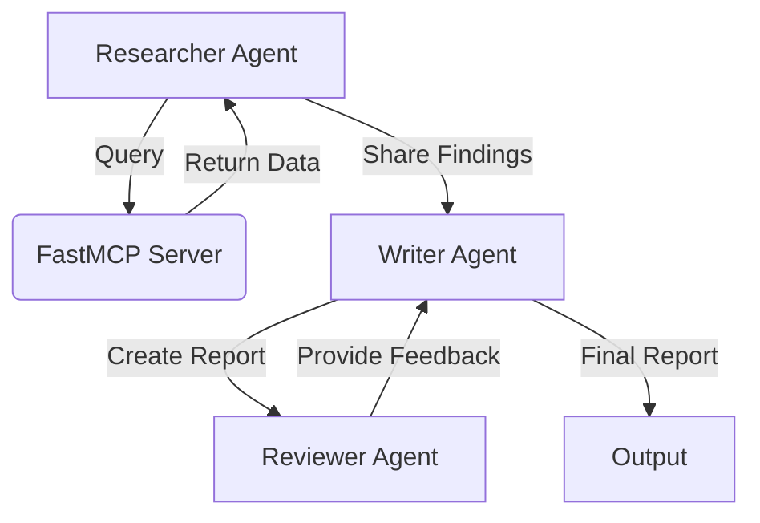
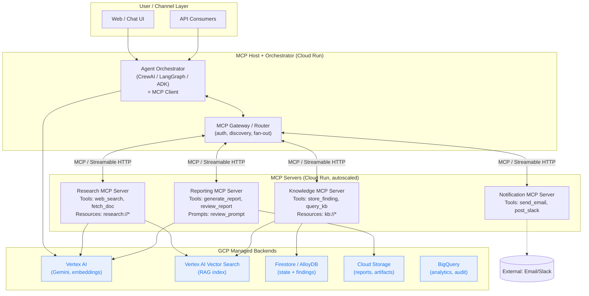
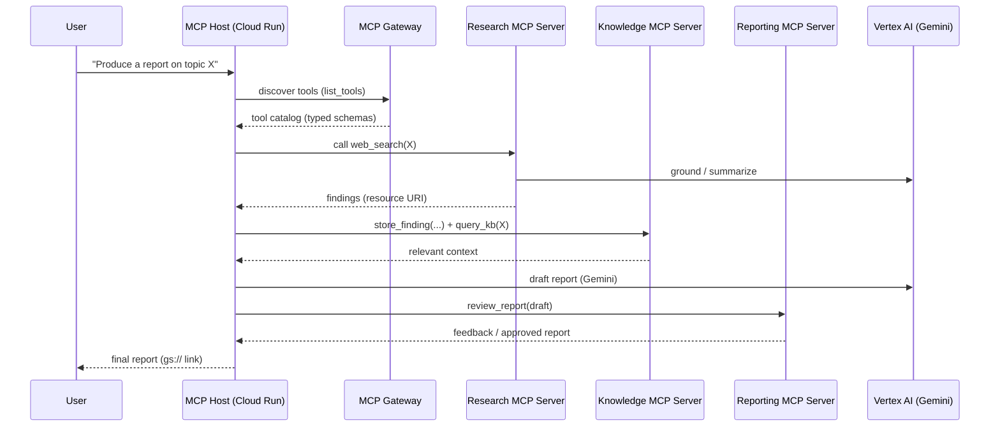
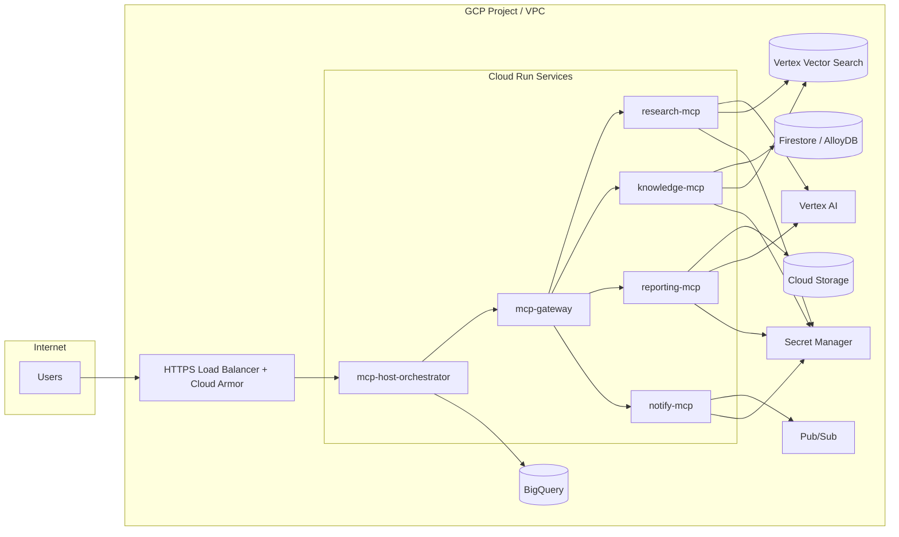
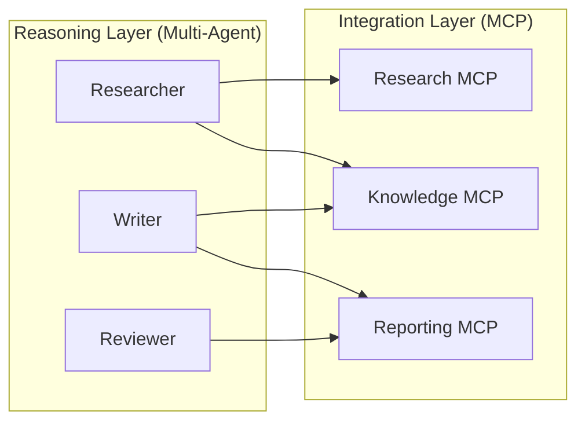

# From Multi-Agent "AI-Enabled Journey" to an MCP-Based Architecture on GCP

> A practical, end-to-end blueprint for re-platforming the existing CrewAI multi-agent
> workflow (Researcher → Writer → Reviewer + FastMCP) into a **Model Context Protocol (MCP)**
> centered architecture deployed on **Google Cloud Platform (GCP)**.
>
> This document covers: the *current* architecture, the *target* MCP architecture on GCP,
> a step-by-step conversion path, the challenges, the advantages of MCP over a "raw" multi-agent
> system, how the two differ, how hard it is to build the required tools, and an honest
> feasibility assessment.

---

## Table of Contents

1. [Context & Goal](#1-context--goal)
2. [The Current "AI-Enabled Journey" Architecture](#2-the-current-ai-enabled-journey-architecture)
3. [What MCP Actually Is (and Why It Matters Here)](#3-what-mcp-actually-is-and-why-it-matters-here)
4. [Target MCP-Based Architecture on GCP](#4-target-mcp-based-architecture-on-gcp)
5. [GCP Resource Mapping](#5-gcp-resource-mapping)
6. [Step-by-Step Conversion Path](#6-step-by-step-conversion-path)
7. [Tools: What We Need to Build and How Hard It Is](#7-tools-what-we-need-to-build-and-how-hard-it-is)
8. [Challenges We Can Face](#8-challenges-we-can-face)
9. [Advantages of MCP Over the Current Multi-Agent System](#9-advantages-of-mcp-over-the-current-multi-agent-system)
10. [How MCP Differs From a Multi-Agent System](#10-how-mcp-differs-from-a-multi-agent-system)
11. [Feasibility Assessment](#11-feasibility-assessment)
12. [Reference Tech Stack & Next Steps](#12-reference-tech-stack--next-steps)

---

## 1. Context & Goal

The repository's `crewai_mcp_course` already demonstrates a **multi-agent journey**: a
`Researcher` agent pulls data, a `Writer` agent drafts a report, and a `Reviewer` agent
provides feedback, with a `FastMCP` server acting as a shared data backend.

**Goal of this document:** Re-architect the above so that **MCP becomes the central
integration contract** for every capability (data access, search, storage, review,
notifications) and deploy the whole thing on **GCP** in a secure, scalable, observable way.
We then evaluate the trade-offs, costs, and effort.

---

## 2. The Current "AI-Enabled Journey" Architecture

### 2.1 Conceptual View

The present design is an **orchestration-first, multi-agent** pattern:

- **Agents are the primary abstraction.** Each agent has a role, a goal, a backstory, and a
  set of bespoke "tools" coded directly against external systems.
- **Tools are tightly coupled.** A `FastMCP` tool, a web-search tool, and a storage tool are
  wired into the agents as Python callables. Swapping a backend means changing agent code.
- **State is mostly in-process.** CrewAI passes context between agents via the orchestration
  framework; shared persistence is bolted on via the single FastMCP server.

### 2.2 Pain Points of the Current Design

| Area | Limitation |
| --- | --- |
| **Reuse** | Tools live inside the agent app. Another team/app cannot call them without copying code. |
| **Governance** | Auth, rate limits, and audit are per-tool, ad hoc. |
| **Scaling** | Agents and tools scale together; a hot tool forces you to scale the whole agent process. |
| **Vendor lock-in** | Tool interfaces are CrewAI-specific; moving to LangGraph/AutoGen means rewriting tools. |
| **Observability** | Tracing crosses agent → tool boundaries inconsistently. |

These pain points are exactly what MCP is designed to address.

---

## 3. What MCP Actually Is (and Why It Matters Here)

The **Model Context Protocol (MCP)** is an open, JSON-RPC-based standard that defines a
**uniform contract** between an LLM/agent ("MCP client/host") and external capabilities
("MCP servers"). An MCP server exposes three core primitives:

| Primitive | Meaning | Example in our journey |
| --- | --- | --- |
| **Tools** | Callable functions with typed input/output schemas | `web_search`, `store_finding`, `generate_report` |
| **Resources** | Readable data (files, rows, documents) addressable by URI | `research://findings/{id}`, `gs://reports/{id}` |
| **Prompts** | Reusable, parameterized prompt templates | `review_report_prompt`, `summarize_prompt` |

Key idea: **the agent no longer owns the integration**. It *discovers* tools/resources from
an MCP server at runtime and calls them through a standard transport (stdio for local,
**Streamable HTTP / SSE** for remote). This decouples *what the agent wants to do* from
*how the capability is implemented and hosted*.

---

## 4. Target MCP-Based Architecture on GCP

### 4.1 High-Level Diagram

### 4.2 What Changed vs. the Original

- The **Researcher / Writer / Reviewer** roles still exist, but they are now thin
  orchestration steps inside the **MCP Host**. Their *capabilities* moved out into **MCP servers**.
- The single `FastMCP` server is split into **domain-scoped MCP servers** (Research,
  Knowledge, Reporting, Notification) that any client can reuse.
- All integrations (search, storage, RAG, review) are now **standard MCP tools/resources**,
  independently deployable and scalable on **Cloud Run**.

### 4.3 Request Flow (Sequence)

---

## 5. GCP Resource Mapping

| Architecture Component | GCP Service | Why |
| --- | --- | --- |
| MCP Host / Orchestrator | **Cloud Run** | Stateless, autoscaling, supports streaming (SSE/Streamable HTTP) needed by MCP. |
| Individual MCP Servers | **Cloud Run** (one service per server) | Independent deploy/scale, per-service IAM, scale-to-zero for cost. |
| MCP Gateway / Router | **Cloud Run** + **API Gateway** (or **Apigee**) | Central auth, routing, quotas, schema discovery aggregation. |
| LLM / Reasoning | **Vertex AI** (Gemini 1.5/2.x), Vertex AI embeddings | Managed models, grounding, function calling, region control. |
| Retrieval / RAG | **Vertex AI Vector Search** | Managed ANN index for findings + knowledge base. |
| State & findings | **Firestore** (fast) or **AlloyDB for PostgreSQL** (relational/transactional) | Shared agent state, conversation memory, findings. |
| Artifacts / reports | **Cloud Storage (GCS)** | Store generated reports, expose as `gs://` MCP resources. |
| Analytics & audit | **BigQuery** | Tool-call logs, usage analytics, cost attribution. |
| Async / decoupling | **Pub/Sub** + **Cloud Tasks** | Long-running tool calls, retries, fan-out to Notification server. |
| Secrets | **Secret Manager** | API keys for external tools (Slack/email/3rd-party search). |
| Identity & access | **IAM** + **Workload Identity** + **Service Accounts** | Per-MCP-server least-privilege; OAuth/OIDC for client→server. |
| Observability | **Cloud Logging**, **Cloud Trace**, **Cloud Monitoring** | Trace MCP JSON-RPC calls end to end. |
| Network / security | **VPC**, **Serverless VPC Connector**, **Cloud Armor** | Private egress to backends, WAF for public endpoints. |
| Edge / delivery | **Cloud Load Balancing** + **Cloud CDN** | TLS, global entry for the UI/API. |
| CI/CD | **Cloud Build** + **Artifact Registry** | Build/push MCP server containers, deploy to Cloud Run. |

### 5.1 Deployment Topology

---

## 6. Step-by-Step Conversion Path

A pragmatic, low-risk migration that keeps the system working at every step.

1. **Inventory current tools.** List every CrewAI tool/callable (search, FastMCP query,
   storage). Capture inputs, outputs, side effects, and required secrets.

2. **Define MCP contracts.** For each capability, write the MCP **tool schema** (name,
   JSON-Schema input/output) and decide what becomes a **resource** (read-only data) vs a
   **tool** (action). Keep names stable — they are your public API.

3. **Build the first MCP server (Research).** Use a framework like **FastMCP** (Python) or
   the official MCP SDK. Wrap the existing search/fetch logic behind the new tool schema.
   Run it locally over stdio, then containerize.

4. **Make the orchestrator an MCP client.** Replace in-process tool calls with MCP
   `list_tools` / `call_tool` over **Streamable HTTP**. CrewAI, LangGraph, and Google's ADK
   all support MCP clients, so the existing roles stay mostly intact.

5. **Strangle-pattern the rest.** Migrate Knowledge, Reporting, and Notification capabilities
   one server at a time. Run old and new in parallel; cut over per capability.

6. **Deploy to Cloud Run.** Containerize each MCP server, push to **Artifact Registry**, deploy
   as separate Cloud Run services. Put the **MCP Gateway** in front for auth and discovery.

7. **Wire managed backends.** Point tools at **Vertex AI**, **Vector Search**, **Firestore/AlloyDB**,
   and **GCS** via service accounts with least privilege.

8. **Add cross-cutting concerns.** OAuth/OIDC auth at the gateway, **Secret Manager** for keys,
   **Cloud Trace** for end-to-end tracing, **BigQuery** sink for audit/usage.

9. **Load test & harden.** Validate autoscaling, set concurrency/timeouts, add **Cloud Armor**,
   and define SLOs in **Cloud Monitoring**.

10. **Decommission the monolithic FastMCP server** once all capabilities are served by the new
    domain MCP servers.

---

## 7. Tools: What We Need to Build and How Hard It Is

"Tools" here means MCP tools/resources/prompts exposed by each server.

| Tool / Capability | MCP Server | Backend | Difficulty | Notes |
| --- | --- | --- | --- | --- |
| `web_search(query)` | Research | External API / Vertex grounding | **Easy** | Thin wrapper over existing search; main work is schema + auth. |
| `fetch_doc(url)` | Research | HTTP fetch + parse | **Easy** | Add timeouts, content-type handling, size limits. |
| `store_finding(doc)` | Knowledge | Firestore/AlloyDB | **Easy–Medium** | Schema design + idempotency keys. |
| `query_kb(query)` | Knowledge | Vertex Vector Search | **Medium** | Requires embedding pipeline + index management. |
| `embed_and_index(doc)` | Knowledge | Vertex AI embeddings + Vector Search | **Medium** | Chunking, batching, index upserts. |
| `generate_report(context)` | Reporting | Vertex AI (Gemini) | **Medium** | Prompt design, streaming, output to GCS. |
| `review_report(draft)` | Reporting | Vertex AI + rubric prompt | **Medium** | Deterministic rubric + structured feedback schema. |
| `send_email` / `post_slack` | Notification | Secret Manager + external API | **Easy–Medium** | Mostly secrets + retry/back-off via Cloud Tasks. |
| Resource: `gs://reports/{id}` | Reporting | Cloud Storage | **Easy** | Signed URLs + IAM. |
| MCP Gateway (auth/discovery) | Gateway | API Gateway/Apigee | **Medium–Hard** | Token validation, per-tool RBAC, schema aggregation, quotas. |

**Overall tool effort:** Most individual tools are **easy-to-medium** because you are
*re-wrapping existing logic* behind a standard schema, not writing new business logic. The
genuinely **harder** pieces are (a) the **gateway/auth/governance layer**, and (b) the
**RAG/embedding pipeline** if it doesn't already exist. The MCP SDK / FastMCP removes most of
the protocol boilerplate, so the cost is mainly schema design, error handling, and tests.

---

## 8. Challenges We Can Face

| # | Challenge | Mitigation |
| --- | --- | --- |
| 1 | **Authn/Authz across remote MCP servers.** MCP auth (OAuth 2.1 / OIDC) is still maturing. | Centralize auth at the gateway; use GCP IAM + service-account identity tokens between Cloud Run services; short-lived tokens. |
| 2 | **Latency from extra network hops.** Client → gateway → MCP server → backend adds round trips vs. in-process calls. | Co-locate in one region, use Streamable HTTP (keep-alive), batch tool calls, cache resources. |
| 3 | **Schema/versioning drift.** Tool contracts change; clients break. | Version tool names, validate with JSON-Schema, contract tests in CI. |
| 4 | **Statefulness vs. scale-to-zero.** MCP sessions + Cloud Run scaling/cold starts. | Keep servers stateless; store session/state in Firestore/AlloyDB; use min-instances for hot servers. |
| 5 | **Long-running tools** (report generation, indexing) exceed request timeouts. | Offload to Pub/Sub + Cloud Tasks; return a resource URI to poll; stream partial results. |
| 6 | **Observability across JSON-RPC hops.** Hard to trace a single user request. | Propagate trace headers; instrument with OpenTelemetry → Cloud Trace; log tool-call IDs to BigQuery. |
| 7 | **Security of tool execution** (prompt injection → tool misuse). | Strict input schemas, allow-lists, human-in-the-loop for destructive tools, Cloud Armor, per-tool quotas. |
| 8 | **Cost sprawl** from many always-on services. | Scale-to-zero for cold servers, min-instances only where needed, budget alerts, BigQuery cost attribution. |
| 9 | **Ecosystem maturity.** MCP is young; SDKs and remote-transport patterns evolve quickly. | Pin SDK versions, abstract transport, follow the spec's revisions, keep servers small. |
| 10 | **Multi-tenancy & data isolation.** Shared MCP servers across teams/customers. | Tenant-scoped service accounts, row-level security in AlloyDB, per-tenant GCS prefixes. |

---

## 9. Advantages of MCP Over the Current Multi-Agent System

> **Important framing:** MCP does **not replace** a multi-agent system — it *complements and
> standardizes* the integration layer underneath it. The advantages below are about adopting
> MCP as the capability contract, compared to the current "tools baked into agents" approach.

1. **Standardized, reusable capabilities.** A tool written once as an MCP server is usable by
   *any* MCP-compatible client (CrewAI, LangGraph, ADK, Claude Desktop, IDEs). No copy-paste.

2. **Decoupling of "what" from "how".** Agents declare intent; MCP servers own the
   implementation. You can change a backend (e.g., swap a search provider) without touching
   agent code.

3. **Independent scaling & deployment.** Each MCP server scales on its own on Cloud Run. A hot
   `query_kb` no longer forces you to scale the whole agent app.

4. **Centralized governance.** Auth, rate limits, quotas, and audit live at the gateway/server,
   not scattered across agents — far better for security and compliance.

5. **Discoverability.** Clients call `list_tools`/`list_resources` at runtime. New capabilities
   become available without redeploying the orchestrator.

6. **Framework portability.** Because MCP is framework-agnostic, you avoid lock-in to one
   agent framework. Migration cost between orchestrators drops dramatically.

7. **Cleaner testing.** MCP servers have typed schemas → contract tests, mocking, and CI become
   straightforward. Tools can be tested in isolation from agents.

8. **Better separation of concerns / smaller blast radius.** A bug or outage in one MCP server
   is isolated; the orchestrator and other tools keep working.

9. **Composability.** Servers can be combined and reused across many "journeys"
   (customer service, research, reporting) instead of being one-off per project.

---

## 10. How MCP Differs From a Multi-Agent System

They operate at **different layers** and are best used **together**.

| Dimension | Multi-Agent System | MCP |
| --- | --- | --- |
| **Primary concern** | *Orchestration* — who does what, in what order, with what reasoning | *Integration* — a standard way to expose and call tools/data |
| **Core abstraction** | Agents (roles, goals, collaboration) | Servers exposing tools / resources / prompts |
| **Layer** | Reasoning & coordination layer | Capability/connectivity layer |
| **Communication** | Agent-to-agent messages, shared memory | Client-to-server JSON-RPC (stdio / HTTP) |
| **State** | Conversation/plan state, often in framework | Stateless tools; state pushed to backends |
| **Reuse boundary** | Within one app/framework | Across apps, teams, and frameworks |
| **Analogy** | The *workers and the manager* | The *USB-C port / API contract* the workers plug into |

**Combined view:** The multi-agent system stays as the *brain* (planning, role-based
collaboration). MCP becomes the *nervous system / standard ports* through which every agent
reaches the outside world. The migration here is **not** "remove agents," it's
"**stop hard-wiring tools into agents and expose them via MCP instead**."

---

## 11. Feasibility Assessment

**Verdict: Highly feasible, and a net improvement** — provided you treat it as *re-platforming
the integration layer*, not rebuilding the agents.

| Factor | Assessment |
| --- | --- |
| **Technical fit on GCP** | ✅ Strong. Cloud Run is ideal for stateless MCP servers (HTTP + streaming + autoscale). Vertex AI, Vector Search, Firestore/AlloyDB, GCS, Pub/Sub cover every backend need. |
| **Reuse of existing code** | ✅ High. Existing CrewAI tools are *wrapped*, not rewritten. The Researcher/Writer/Reviewer roles persist. |
| **Effort distribution** | 🟡 Most tools are easy–medium; the gateway/auth/governance and RAG pipeline are the heavy lifts. |
| **Operational complexity** | 🟡 Increases (more services, network hops, tracing) but is offset by independent scaling, isolation, and governance. |
| **Ecosystem risk** | 🟡 MCP is young; pin versions and abstract the transport to absorb spec changes. |
| **Cost** | 🟢 Controllable with scale-to-zero + min-instances only where needed; BigQuery for cost attribution. |
| **Migration risk** | 🟢 Low if you use the strangler pattern (one capability at a time, parallel run, per-capability cutover). |

### When MCP is clearly worth it
- Multiple apps/teams need the **same** tools.
- You want **framework portability** (CrewAI today, maybe LangGraph/ADK tomorrow).
- You need **central governance, audit, and security** for tool usage.

### When to keep it simple (don't over-engineer)
- A single, small, single-team journey with 2–3 stable tools may not need a full MCP fleet.
  In that case, start with **one** MCP server and grow only as reuse demands it.

---

## 12. Reference Tech Stack & Next Steps

**Suggested stack**

- **Orchestration / MCP client:** CrewAI (current), or LangGraph / Google ADK — all MCP-aware.
- **MCP servers:** FastMCP or official MCP Python SDK, containerized.
- **Runtime:** Cloud Run (host + per-domain MCP servers), API Gateway/Apigee (MCP gateway).
- **AI:** Vertex AI (Gemini + embeddings), Vertex AI Vector Search.
- **Data:** Firestore / AlloyDB, Cloud Storage, BigQuery.
- **Async:** Pub/Sub + Cloud Tasks.
- **Platform:** IAM + Workload Identity, Secret Manager, VPC + Serverless VPC Connector,
  Cloud Armor, Cloud Build + Artifact Registry, Cloud Logging/Trace/Monitoring.

**Recommended next steps**

1. Run a **2-week spike**: convert one capability (`web_search`) into an MCP server on Cloud Run
   and call it from the existing CrewAI orchestrator.
2. Stand up the **MCP gateway** with OAuth/OIDC and IAM-based service-to-service auth.
3. Add **Cloud Trace + BigQuery audit** before migrating more capabilities.
4. Apply the **strangler pattern** to migrate Knowledge, Reporting, and Notification servers.
5. Define **SLOs and budgets**, then decommission the monolithic FastMCP server.

---

### TL;DR

- **Keep** the multi-agent reasoning (Researcher/Writer/Reviewer).
- **Move** every tool/data integration behind **MCP servers** on **Cloud Run**.
- **Use** Vertex AI + Vector Search + Firestore/AlloyDB + GCS + Pub/Sub as managed backends.
- **Gain** reusability, governance, independent scaling, and framework portability.
- **Watch out for** auth maturity, extra latency, versioning, and operational complexity.
- **Feasibility:** High — wrap existing tools, migrate incrementally, don't rebuild the agents.
