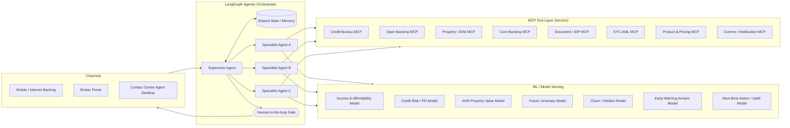
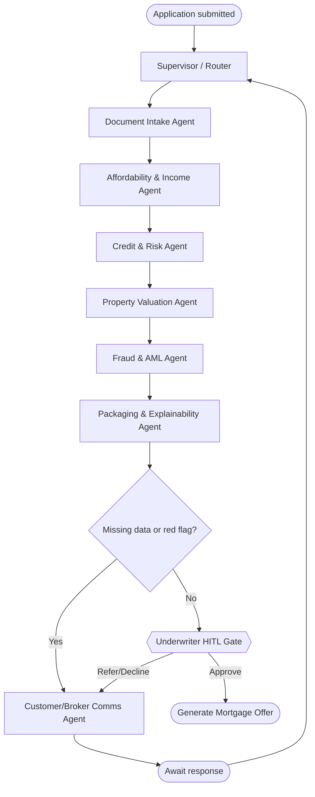
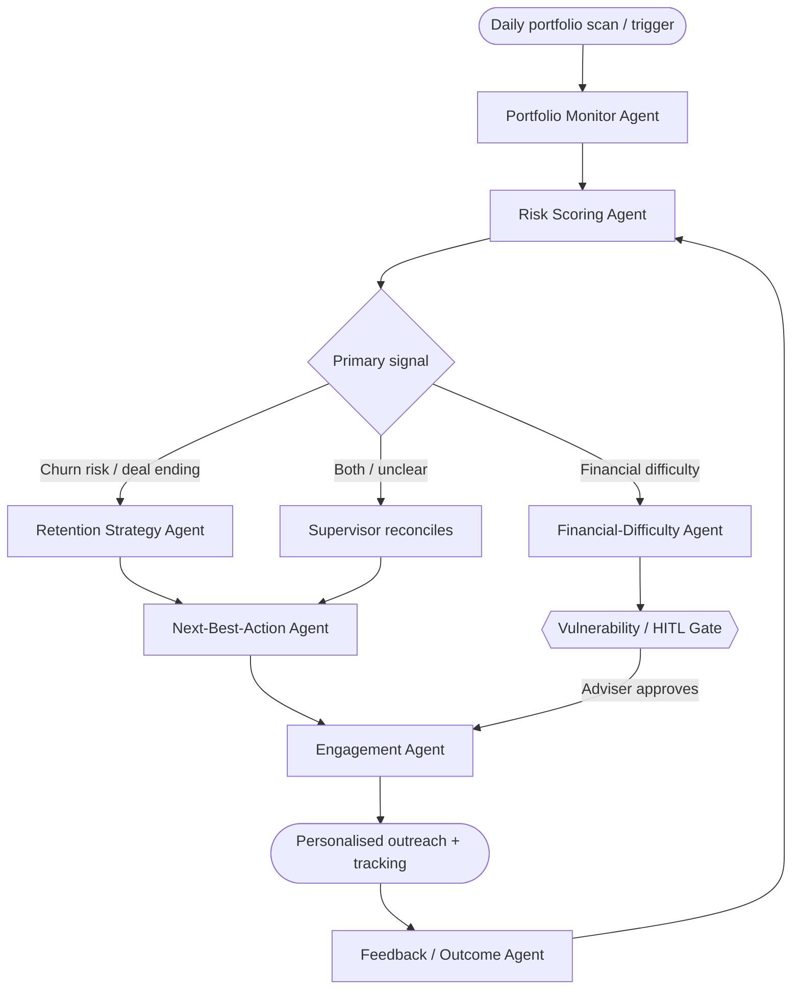

# 🏦 Agentic AI Use Cases — Lloyds Bank | Consumer Lending → Home Loans

> **Domain:** Banking & Financial Services
> **Department:** Consumer Lending
> **Sub‑Department:** Home Loans (Mortgages)
> **Organisation context:** Lloyds Banking Group (Lloyds Bank / Halifax / Bank of Scotland mortgage brands)
> **Tech building blocks:** Agentic AI · Model Context Protocol (MCP) tools · **LangGraph** orchestration · Classical & deep **Machine Learning**
> **Regulatory frame:** FCA **Consumer Duty**, MCOB (Mortgage Conduct of Business), UK GDPR/DPA 2018, PRA affordability rules, AML/KYC

This document defines **two production‑grade business use cases** for the Home Loans sub‑department. Each use case includes the *current* business problem, the agentic solution, a LangGraph architecture, the MCP tool surface, the ML models that power decisions, the customer‑experience (UX) uplift, measurable KPIs, and the compliance/risk posture.

---

## 📌 Why Home Loans, Why Now?

A mortgage is the largest, most emotional, and most paperwork‑heavy product a retail bank sells. For Lloyds Banking Group — the **UK's largest mortgage lender** — even small percentage gains in conversion, time‑to‑offer, retention, and arrears prevention translate into very large commercial and customer‑outcome impact. Two structural pain points dominate:

1. **Acquisition friction** — getting *to* a mortgage offer is slow, manual, and opaque, causing applicant drop‑off and broker frustration.
2. **Lifecycle leakage** — at the end of a fixed‑rate deal customers silently remortgage to a competitor, while cost‑of‑living pressure pushes others toward payment shock and arrears.

The two use cases below target exactly these two stages.

---

## 🧭 Shared Reference Architecture

Both use cases share the same agentic foundation so they can be built once and reused.



**Design principles**

- **Supervisor / multi‑agent pattern in LangGraph** — a `Supervisor` node routes to specialist sub‑agents; each agent is a node, each handoff is an edge, and progress is persisted in a typed `State` object with checkpointing for durability and resume.
- **MCP as the tool boundary** — every external capability (credit bureau, Open Banking, valuation, core banking, documents, comms) is exposed as an **MCP server** with typed tools. Agents discover and call tools via MCP, which keeps integrations decoupled, auditable, and reusable across both use cases.
- **ML models are tools too** — predictive models are served behind MCP tools / model endpoints so agents *reason*, but **deterministic ML makes the scored decisions** (the LLM never invents a credit score).
- **Human‑in‑the‑loop (HITL)** — LangGraph `interrupt` gates pause the graph for underwriter / adviser approval on material or edge‑case decisions, satisfying Consumer Duty and explainability.

---

# 🟦 Use Case 1 — "Mortgage Journey Accelerator": Agentic Application & Underwriting Co‑pilot

> 📐 **Detailed GCP architecture** (data ingestion → ML → agentic LLM → production → observability/evaluation, with guardrails, PII masking, HITL, LLM cost strategy & business justification): see [`uc1-mortgage-journey-accelerator-gcp-architecture.md`](uc1-mortgage-journey-accelerator-gcp-architecture.md).
>
> 🎙️ **Consumer‑facing conversational & voice assistant** ("Lloyds Home Coach") that fronts this use case for first‑time buyers, movers, remortgagers & BTL — incl. a competitor/market scan of bank AI mortgage assistants: see [`uc1-conversational-voice-mortgage-assistant.md`](uc1-conversational-voice-mortgage-assistant.md).

### 1.1 Current Business Problem

Today a home‑loan application at a large UK lender is a multi‑week, stop‑start journey:

- **Manual document chase.** Applicants upload payslips, bank statements, ID, and proof of deposit in fragments. Processors manually read, key, and re‑request missing items. ~30–50% of applications need at least one document re‑request, each adding days.
- **Disconnected affordability & risk checks.** Income verification, expenditure assessment, credit search, and property valuation happen in separate systems and teams, with hand‑offs and queues.
- **Opaque status.** Customers and brokers cannot see *where* the application is or *why* it is stuck, generating high inbound call volume ("where is my mortgage?").
- **Slow time‑to‑offer.** Average time from full application to formal mortgage offer is often **2–4 weeks**, a leading cause of drop‑off, broker dissatisfaction, and lost completions in a competitive purchase chain.
- **Inconsistent decisions.** Manual underwriting introduces variability and rework, and edge cases (self‑employed, contractors, complex income) are especially slow.

> **Net impact:** lower conversion, higher cost‑to‑serve, broker churn, and a poor first experience at the most important moment of the customer relationship.

### 1.2 The Agentic Solution

An **agentic underwriting co‑pilot** that turns a pile of documents into a *fully packaged, risk‑assessed, decision‑ready* application — autonomously gathering data, running the ML risk stack, identifying gaps, and producing an explainable recommendation, while keeping a human underwriter in control of the final decision.

### 1.3 LangGraph Orchestration



**Agents (LangGraph nodes)**

| Agent | Responsibility | Key MCP tools | ML used |
|---|---|---|---|
| **Supervisor** | Routes, tracks state, enforces SLA, decides next agent | — | routing policy |
| **Document Intake** | Classify, extract, validate uploaded docs (payslips, statements, ID, deposit proof) | Document/IDP MCP, KYC‑AML MCP | Document classification + OCR/IDP, entity extraction |
| **Affordability & Income** | Verify income, categorise spend, compute affordability & stress test | Open Banking MCP, Document MCP | Transaction categorisation, income‑estimation model |
| **Credit & Risk** | Pull bureau data, score default risk, apply policy rules | Credit Bureau MCP, Core Banking MCP | **PD / credit‑risk model** |
| **Property Valuation** | Estimate property value & LTV, flag valuation risk | Property/AVM MCP | **AVM regression model** |
| **Fraud & AML** | Detect anomalies, synthetic ID, doc tampering, sanctions | KYC‑AML MCP, Document MCP | Anomaly / fraud model |
| **Packaging & Explainability** | Assemble case file, produce reason codes & adverse‑action explanation | Core Banking MCP | SHAP‑based reason codes |
| **Comms** | Personalised gap requests & status updates | Comms MCP | NBA for message tone/channel |

### 1.4 MCP Tool Surface (illustrative)

```jsonc
// Credit Bureau MCP server — tool definitions
{
  "tools": [
    { "name": "get_credit_report",
      "description": "Soft/hard credit search for an applicant",
      "input_schema": { "applicant_id": "string", "search_type": "soft|hard" } },
    { "name": "get_affordability_indicators",
      "description": "Bureau-derived indebtedness & utilisation",
      "input_schema": { "applicant_id": "string" } }
  ]
}
```

```jsonc
// Open Banking MCP server
{ "tools": [
    { "name": "fetch_transactions",
      "input_schema": { "consent_token": "string", "from": "date", "to": "date" } },
    { "name": "verify_income",
      "input_schema": { "consent_token": "string" } } ] }
```

```jsonc
// Property / AVM MCP server
{ "tools": [
    { "name": "estimate_property_value",
      "input_schema": { "uprn": "string", "postcode": "string", "property_type": "string" } },
    { "name": "land_registry_lookup",
      "input_schema": { "title_number": "string" } } ] }
```

LangGraph agents bind these MCP servers (e.g. via `langchain-mcp-adapters`) and the LLM selects/sequences tools; results are written back into shared graph state.

### 1.5 Machine Learning Stack

| Model | Problem type | Recommended algorithm | Why |
|---|---|---|---|
| **Document classification** | Multiclass image/text | Fine‑tuned transformer / CNN + layout model (e.g. LayoutLM‑style) | Robust to varied document layouts |
| **Information extraction (IDP)** | Sequence labelling / OCR | OCR + transformer NER | Auto‑key fields, removes manual entry |
| **Transaction categorisation** | Multiclass classification | Gradient boosting (XGBoost/LightGBM) on engineered features | Fast, explainable spend buckets |
| **Income estimation / verification** | Regression | Gradient boosting + rules | Verifies declared vs observed income |
| **Affordability / stress test** | Deterministic + ML residual | Rules engine + GBM | Regulator‑aligned, with ML for edge income |
| **Credit risk / PD** | Binary classification | Logistic regression **and** gradient boosting (champion/challenger) | Logistic = explainable & regulator‑accepted; GBM = lift |
| **Property AVM** | Regression | Gradient boosting / quantile regression | Value + confidence interval for LTV risk |
| **Fraud / synthetic ID** | Anomaly + classification | Isolation Forest + gradient boosting | Catches novel + known fraud patterns |
| **Reason codes** | Explainability | SHAP on PD/AVM models | Adverse‑action & Consumer Duty transparency |

> **Decisioning principle:** the LLM agents *orchestrate and explain*; the **ML models produce the scores**, and a **deterministic policy/rules layer** converts scores into accept/refer/decline within risk appetite.

### 1.6 Customer / Broker Experience Uplift

- **"Apply, snap, done."** Upload documents once; the intake agent reads everything and asks only for what is genuinely missing — in plain language.
- **Real‑time, explainable status.** Customers and brokers see the live stage ("verifying income", "valuing property") instead of a black box, cutting "where's my mortgage?" calls.
- **Days, not weeks.** Straight‑through cases reach a decision in hours; complex cases land on an underwriter's desk pre‑packaged.
- **Fairer, consistent decisions** with auditable reason codes.

### 1.7 Business Value / KPIs

| KPI | Target direction |
|---|---|
| Time from full application → offer | ↓ from weeks to days/hours |
| Document re‑request rate | ↓ significantly |
| Straight‑through processing rate | ↑ |
| Application‑to‑completion conversion | ↑ |
| Cost‑to‑serve per application | ↓ |
| Underwriter cases handled per FTE | ↑ |
| "Status" inbound contacts | ↓ |

---

# 🟩 Use Case 2 — "Home Loan Lifecycle Guardian": Proactive Retention & Financial‑Difficulty Advisor

### 2.1 Current Business Problem

Once a mortgage is on the book, value silently leaks at two moments:

- **End of fixed‑rate churn.** Most UK mortgages are fixed for 2–5 years. As the deal end nears, rate‑savvy customers (and their brokers) remortgage to a competitor. Banks react *late* (generic letters), so they lose profitable balances and the relationship.
- **Payment shock & arrears.** Refinancing onto a higher rate plus cost‑of‑living pressure pushes some customers toward missed payments. By the time arrears appear, options are limited, outcomes are worse, and **FCA Consumer Duty** expects firms to *proactively* support customers — especially vulnerable ones — and avoid foreseeable harm.

Existing processes are **reactive, batch, and one‑size‑fits‑all**: campaigns fire on calendar dates, not on individual risk/need, and hardship support kicks in only after distress is visible.

> **Net impact:** balance attrition to competitors, avoidable arrears and impairment costs, Consumer Duty exposure, and poor customer outcomes at financially fragile moments.

### 2.2 The Agentic Solution

A **continuously‑running, proactive agentic guardian** over the mortgage book that, for each customer, predicts *churn risk* and *financial‑difficulty risk*, then orchestrates the **next best action** — a tailored product‑transfer offer to retain, or an empathetic, compliant forbearance pathway to support — always with HITL for vulnerable‑customer and material decisions.

### 2.3 LangGraph Orchestration



**Agents (LangGraph nodes)**

| Agent | Responsibility | Key MCP tools | ML used |
|---|---|---|---|
| **Portfolio Monitor** | Detect deal‑end windows, behaviour shifts, triggers | Core Banking MCP | event/feature triggers |
| **Risk Scoring** | Score churn & arrears risk per customer | Core Banking, Open Banking MCP | **Churn model + Early‑warning arrears model** |
| **Retention Strategy** | Simulate product‑transfer options & retention economics | Product & Pricing MCP | uplift / price‑elasticity |
| **Financial‑Difficulty** | Re‑assess affordability, build forbearance options (term extension, switch to interest‑only, payment holiday) | Open Banking, Core Banking MCP | affordability re‑assessment |
| **Next‑Best‑Action** | Choose optimal action, channel, timing | Product & Pricing MCP | **NBA / uplift model, contextual bandit** |
| **Engagement** | Deliver empathetic, compliant, personalised message | Comms MCP | tone/channel personalisation |
| **Feedback / Outcome** | Learn from responses, update models, close loop | Core Banking MCP | online learning signals |
| **Supervisor** | Reconcile conflicting signals, enforce Consumer Duty guardrails | — | policy |

### 2.4 MCP Tool Surface (illustrative)

```jsonc
// Product & Pricing MCP server
{ "tools": [
    { "name": "get_eligible_products",
      "input_schema": { "account_id": "string", "ltv": "number" } },
    { "name": "simulate_product_transfer",
      "input_schema": { "account_id": "string", "product_code": "string" } },
    { "name": "simulate_forbearance",
      "input_schema": { "account_id": "string",
        "option": "term_extension|interest_only|payment_holiday|reduced_payment" } } ] }
```

```jsonc
// Comms / Notification MCP server
{ "tools": [
    { "name": "send_personalised_offer",
      "input_schema": { "customer_id": "string", "channel": "app|email|sms|letter", "content_id": "string" } },
    { "name": "schedule_adviser_callback",
      "input_schema": { "customer_id": "string", "priority": "standard|vulnerable" } } ] }
```

### 2.5 Machine Learning Stack

| Model | Problem type | Recommended algorithm | Why |
|---|---|---|---|
| **Churn / attrition prediction** | Binary classification / time‑to‑event | Gradient boosting (XGBoost/LightGBM) **+ survival analysis** (Cox / survival GBM) | Predicts *who* and *when* (deal‑end horizon) |
| **Early‑warning arrears** | Binary classification | Gradient boosting on payment + Open Banking features | Detect distress *before* a missed payment |
| **Affordability re‑assessment** | Regression + rules | GBM + rules engine | Sustainable forbearance options |
| **Next‑Best‑Action / treatment effect** | Uplift / causal | **Uplift modelling** (two‑model / causal forest) + **contextual bandits** for live optimisation | Act on *persuadable* customers; learn online |
| **Customer lifetime value** | Regression | Gradient boosting | Prioritise retention spend |
| **Vulnerability signal detection** | Classification (carefully governed) | Interpretable model + rules, human oversight | Trigger enhanced care, not automated harm |
| **Explainability** | Reason codes | SHAP | Justify treatment, support Consumer Duty audit |

> The **uplift + contextual‑bandit** combination is the heart of UX value: it optimises *which* intervention helps *each* customer, then learns continuously from outcomes.

### 2.6 Customer Experience Uplift

- **Proactive, not reactive.** The bank reaches out *before* the rate cliff with a relevant, pre‑modelled product‑transfer offer the customer can accept in a couple of taps — reducing the need to shop around.
- **No payment‑shock surprises.** Customers at risk of difficulty get an empathetic, early conversation and concrete, affordable options (term extension, temporary interest‑only, reduced payment) — not a debt letter.
- **Dignified, vulnerable‑aware support.** Sensitive cases are routed to a human adviser with full context; the agent assists, the human decides.
- **Right message, right channel, right time**, personalised per customer rather than mass mailshots.

### 2.7 Business Value / KPIs

| KPI | Target direction |
|---|---|
| Mortgage balance retention at deal‑end | ↑ |
| Product‑transfer take‑up | ↑ |
| Early intervention before first missed payment | ↑ |
| Roll‑rate into arrears / impairment charges | ↓ |
| Consumer Duty good‑outcome evidence | ↑ (auditable) |
| Customer satisfaction / NPS at deal‑end & support | ↑ |
| Cost of retention & collections | ↓ |

---

## 🔄 How the Two Use Cases Reinforce Each Other

| | Use Case 1 — Journey Accelerator | Use Case 2 — Lifecycle Guardian |
|---|---|---|
| **Stage** | Acquisition / origination | Servicing / retention / support |
| **Primary problem** | Slow, manual, opaque time‑to‑offer | Silent churn + arrears risk |
| **Agentic mode** | Event‑driven (per application) | Continuous (portfolio sweep) |
| **Headline ML** | PD, AVM, IDP, fraud | Churn/survival, early‑warning arrears, uplift |
| **Shared assets** | MCP tool layer, LangGraph supervisor pattern, model‑serving, HITL gates, audit/XAI |

Building Use Case 1 establishes the MCP tool servers (credit, Open Banking, core banking, comms) and the LangGraph supervisor scaffold; Use Case 2 reuses them, so the second delivery is materially cheaper.

---

## 🛡️ Compliance, Risk & Responsible AI (applies to both)

- **FCA Consumer Duty** — every automated action must evidence a *good customer outcome*; HITL gates and SHAP reason codes provide the audit trail.
- **MCOB & affordability rules** — ML supports but a **deterministic, regulator‑aligned affordability/policy layer** governs lend/forbear decisions.
- **Explainability** — champion logistic models + SHAP give adverse‑action reason codes; no unexplained "black‑box" declines.
- **Fairness & bias testing** — monitor decisions across protected groups; document model risk under SR 11‑7 / PRA model‑risk expectations.
- **Data protection** — UK GDPR lawful basis, Open Banking explicit consent, data minimisation, PII handling inside MCP tool boundaries.
- **Human accountability** — agents recommend; accountable humans approve material and vulnerable‑customer decisions.
- **Durability & auditability** — LangGraph checkpointing records every state transition and tool call for full traceability.

---

## 🧱 Indicative Tech Stack

- **Orchestration:** LangGraph (multi‑agent supervisor, typed state, checkpointer, `interrupt` for HITL)
- **Tooling boundary:** MCP servers per system of record (`langchain-mcp-adapters` to bind tools)
- **LLM:** enterprise‑hosted/governed model for reasoning, summarisation, comms drafting (not for scoring)
- **ML:** scikit‑learn / XGBoost / LightGBM, survival & uplift libraries, SHAP; served via model endpoints exposed as MCP tools
- **MLOps & governance:** feature store, model registry, monitoring/drift, bias dashboards, immutable audit log

---

## ✅ Talking Points for Stakeholder Discussion

1. **Commercial:** faster offers lift purchase‑market win‑rate; proactive retention defends the back book — both move balances and impairment.
2. **Customer:** removes the two worst moments (the agonising wait, and the payment‑shock surprise).
3. **Regulatory:** purpose‑built for Consumer Duty with explainability and human oversight baked in.
4. **Build economics:** one agentic + MCP foundation, two high‑value use cases, reusable for the wider Consumer Lending book (cards, loans).
