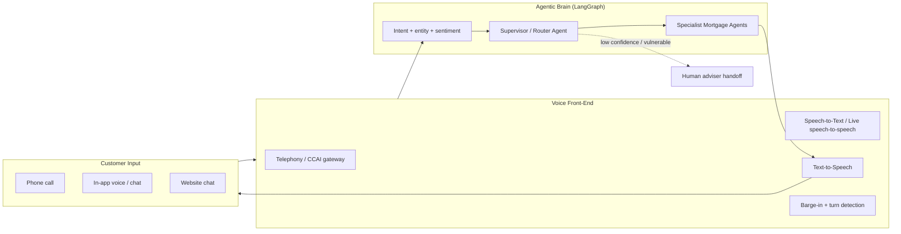

# 🎙️ Use Case 1 (Extended) — "Lloyds Home Coach": Conversational & Voice Mortgage Assistant for Consumers

> **Companion to:** [`lloyds-home-loans-agentic-ai-usecases.md`](lloyds-home-loans-agentic-ai-usecases.md) · [`uc1-mortgage-journey-accelerator-gcp-architecture.md`](uc1-mortgage-journey-accelerator-gcp-architecture.md)
> **Source product context:** Lloyds Bank Mortgages (`lloydsbank.com/mortgages.html`) — First‑Time Buyer, Home Mover, Remortgage, Buy‑to‑Let, plus tools (Borrowing/Affordability calculators, Agreement in Principle).
> **What this adds to Use Case 1:** a **consumer‑facing, multi‑channel conversational + voice (speech) assistant** that sits *in front of* the Mortgage Journey Accelerator. The assistant educates, guides, qualifies, and warms up every type of mortgage customer; when the customer is ready, it hands off — with full context — into the agentic underwriting pipeline from Use Case 1.
>
> 🛠️ **Build‑ready execution plan & Low‑Level Design** (GCP‑only, Python backend / Node.js UI, Cortex API LLM gateway, Pegasus evaluation, Dynatrace observability, Harness CI/CD, full repo file structure): see [`uc1-voice-mortgage-assistant-execution-plan-lld.md`](uc1-voice-mortgage-assistant-execution-plan-lld.md).

---

## 1. Why this use case (and why now)

Lloyds Banking Group is the UK's largest mortgage lender and is moving aggressively into **agentic AI**: it has publicly committed to launching the **UK's first large‑scale, multi‑feature agentic AI financial assistant** for 21M+ mobile customers in early 2026, built on its own **Gen AI + Agentic framework with guardrails and human escalation**, and reports gen‑AI value of ~£50M (2025) rising to £100M+ (2026). Its internal **Athena** knowledge tool already cut colleague search times by 66%.

A **mortgage‑specialist conversational + voice assistant** is the natural, high‑value extension of that strategy into the single most complex, emotional, and high‑drop‑off retail journey: buying or refinancing a home.

---

## 2. The Business Problem

### 2.1 Problem statement
> **First‑time buyers and existing homeowners find mortgages confusing, jargon‑heavy, and intimidating. Today they self‑serve across static web pages and calculators (many requiring forms and logins), or wait on hold for a human adviser. The result is low confidence, abandoned journeys, repetitive contact‑centre volume, and a slow path from "curious" to "ready to apply." There is no single, always‑on, conversational guide — by chat *or voice* — that can answer any mortgage question, personalise it to the customer's situation and Lloyds' products, qualify them, and warm‑hand them into application — while staying compliant, explainable, and human‑escalatable.**

### 2.2 Pain points by customer type
| Customer type | Today's pain |
|---|---|
| **First‑time buyer** | Doesn't understand deposits (5% min), LTV, AIP, fees, schemes (e.g. **Lend a Hand** 100% / family‑assisted, **Club Lloyds FTB** rates); fears rejection; overwhelmed by jargon |
| **Home mover** | Unsure whether to **port** an existing deal, how much they can borrow now, timing the chain |
| **Remortgager** | Doesn't know when their fixed deal ends, whether to switch/borrow more, or what their options cost |
| **Buy‑to‑let** | Confused on rental‑coverage/affordability rules and product differences |
| **Existing customer in difficulty** | Anxious about rate changes/payment shock; doesn't know support options exist |
| **All** | "Where do I even start?", "How much can I borrow?", "Will I be accepted?", "What will it cost me a month?" — often outside 9–5, often needing *voice* not forms |

### 2.3 Net impact
Low conversion from interest → AIP → application, high contact‑centre cost for repetitive questions, accessibility gaps (customers who can't/won't fill forms), and missed opportunities to retain and support existing customers.

---

## 3. Competitor & Market Landscape — what other banks/lenders are doing with AI in mortgages

> Researched from public 2025–2026 reporting. This validates demand and shapes our differentiated design.

| Org | What they built | How AI is used | How it helps |
|---|---|---|---|
| **PennyMac** (US) | Borrower‑facing **voice agent** on AWS (Amazon **Nova Sonic** speech‑to‑speech) | 24/7 phone conversations, real‑time responses, identify loan options, schedule callbacks, send application links; automated document processing | Fast, "human‑feeling" voice experience at every step; round‑the‑clock engagement |
| **ING** (NL) | **Agentic mortgage assistant** (gen‑AI chatbot, testing speech‑to‑speech) | Gathers & checks documents, moves cases between systems, explains outcomes/next steps; **human makes final decision** | Faster decisions, clearer outcomes; staff freed for complex cases & broker contact |
| **NatWest** (UK) | Home‑buying & remortgage guidance **inside ChatGPT** | Public APIs to calculate borrowing, test affordability/deposit scenarios, tailored rates; conversation resumable; branded responses | Meets customers where they are; supports early planning; signposts to advice/application |
| **Newrez** (US) | **Rezi Mortgage Assistant** in the GPT Store | LLM grounded in internal underwriting guidelines; conversational, 24/7; no forms until ready | Demystifies the process, removes friction, eases sales pressure |
| **Better.com** (US) | **Betsy** — voice‑based AI loan assistant on Tinman | Conversational voice to answer inquiries and collect outstanding application data across POS/CRM/LOS/pricing | Instant, accurate answers; "chatbots don't work — voice does" |
| **TD Bank** (US) | Agentic AI for applications | Gathers & summarises application documents | Reduced time‑to‑decision |
| **Lloyds Banking Group** (UK) | **Agentic AI financial assistant** (21M+ customers, 2026) + **Athena** (internal) | Gen AI + agentic framework with guardrails, natural conversation, hyper‑personalisation, human escalation | 24/7 personalised coaching; expanding to savings/borrowing/investments |

**Patterns we learned and adopt**
1. **Voice is the differentiator** (PennyMac, Better.com) — chat alone fatigues users; **speech‑to‑speech** feels human.
2. **Ground answers in the bank's own policy/products** (Newrez, NatWest, Lloyds) — not generic LLM output.
3. **Always human‑in‑the‑loop for decisions** (ING, TD) — AI guides; humans decide.
4. **Meet customers early and where they are** (NatWest in ChatGPT) — pre‑application, no forms.
5. **Strong governance** — audit trails, bias monitoring, guardrails are table stakes.

**Our differentiation:** a single **mortgage‑specialist** assistant that is (a) **omni‑channel incl. true voice**, (b) **personalised to the Lloyds product set**, (c) **directly wired into the agentic underwriting pipeline (Use Case 1)** so guidance flows seamlessly into a real Agreement in Principle and application — not a dead‑end chatbot.

---

## 4. The Solution — "Lloyds Home Coach"

An always‑on, **voice‑ and chat‑based agentic assistant** that any mortgage customer can simply *talk to*. It:

- **Educates** — answers any mortgage question in plain English, grounded in Lloyds products & policy (RAG).
- **Personalises** — tailors guidance by customer type (first‑time buyer, mover, remortgage, BTL) and circumstances.
- **Calculates** — "How much can I borrow?", "What's my monthly cost?", deposit/LTV/affordability scenarios via ML + tools.
- **Qualifies & warms up** — runs an indicative eligibility/affordability check and a soft **Agreement in Principle** flow.
- **Hands off** — when the customer is ready, passes full context into the **Mortgage Journey Accelerator** (Use Case 1) for document intake, ML risk scoring, and underwriting.
- **Escalates** — seamlessly routes to a human mortgage adviser for advice or complex/vulnerable cases.

### 4.1 Channels
- **Voice:** telephony (24/7 phone line) and in‑app voice — true **speech‑to‑speech** for natural conversation.
- **Chat:** mobile app, internet banking, public website widget.
- **Accessibility‑first:** voice removes the form barrier for customers who struggle with web forms or have accessibility needs.

### 4.2 What it covers (grounded in Lloyds' product set)
First‑Time Buyer (incl. **Lend a Hand** family‑assisted / low‑deposit, **Club Lloyds** FTB rates, 5% deposit), Home Mover (incl. **porting**), Remortgage (switch / borrow more / deal‑end timing), Buy‑to‑Let, and signposting to support for customers worried about payments (links to Use Case 2 — Lifecycle Guardian).

---

## 5. Voice / Speech Agent Design

**Key voice design choices**
- **Speech‑to‑speech / low latency** (e.g. Gemini Live API or STT+LLM+TTS pipeline) for natural, interruptible conversation with **barge‑in** support.
- **Sentiment & vulnerability detection** on the audio/text stream to trigger empathy responses and human escalation.
- **Voice biometrics / step‑up auth** before exposing any account‑specific data.
- **Multilingual + accessibility** support; consistent persona across voice and chat.
- **Graceful escalation** — warm transfer to a human adviser with full conversation context (no "start over").

---

## 6. Overall Architecture — Agentic AI + MCP Tools + ML

```mermaid
flowchart TD
    subgraph CH["Channels"]
        C1[Phone]
        C2[Mobile App / Internet Banking]
        C3[Website widget]
    end

    subgraph VF["Voice / Conversation Front-End"]
        V1[Telephony + STT/TTS / Speech-to-speech]
        V2[Auth + voice biometrics]
    end

    subgraph ORCH["Agentic Orchestration (LangGraph)"]
        SUP[Supervisor / Router]
        EDU[Education & Q&A Agent]
        ELIG[Eligibility & Affordability Agent]
        PROD[Product Match Agent]
        AIP[Agreement-in-Principle Agent]
        HANDOFF[Handoff & Escalation Agent]
        GUARD[Guardrails + PII masking]
        MEM[(Session + long-term memory)]
    end

    subgraph LLM["LLM + Knowledge"]
        GEM[Gemini Flash/Pro - reasoning & language]
        VS[Vector Search - Lloyds policy & product RAG]
    end

    subgraph MCP["MCP Tool Layer"]
        T1[Borrowing/Affordability Calculator MCP]
        T2[Product & Rates Catalogue MCP]
        T3[Soft Credit Check MCP]
        T4[Customer / Core Banking MCP]
        T5[Appointment / Adviser Booking MCP]
        T6[Open Banking MCP]
        T7[Knowledge / Content MCP]
    end

    subgraph ML["ML Models"]
        M1[Affordability / borrowing-amount model]
        M2[Eligibility / pre-qual PD model]
        M3[Product recommendation / next-best-action]
        M4[Intent & sentiment / vulnerability model]
        M5[Conversion propensity model]
    end

    subgraph UC1["➡ Use Case 1: Mortgage Journey Accelerator"]
        DOC[Document Intake + Underwriting agents]
    end

    CH --> VF --> SUP
    SUP <--> MEM
    SUP --> EDU & ELIG & PROD & AIP & HANDOFF
    EDU --> GEM --> GUARD
    EDU --> VS
    ELIG --> M1 & M2
    PROD --> M3
    SUP --> M4
    HANDOFF --> M5
    ELIG --> T1 & T3 & T6
    PROD --> T2
    AIP --> T3 & T4
    HANDOFF --> T5
    EDU --> T7
    AIP --> DOC
    HANDOFF --> HUMAN[Human mortgage adviser]
```

### 6.1 Agentic AI (LangGraph) — agents
| Agent | Role |
|---|---|
| **Supervisor / Router** | Detects intent & customer type, routes, maintains context, enforces guardrails & SLAs |
| **Education & Q&A** | Answers any mortgage question, **grounded** in Lloyds policy/products via RAG (no hallucinated rates/criteria) |
| **Eligibility & Affordability** | Runs borrowing/affordability scenarios; soft pre‑qualification |
| **Product Match** | Recommends suitable products (FTB, mover, remortgage, BTL, Lend a Hand) for the customer's situation |
| **Agreement‑in‑Principle** | Guides the soft‑search AIP flow conversationally; produces an indicative decision |
| **Handoff & Escalation** | Books advisers, warm‑transfers to humans, and **hands off into Use Case 1** for full application |

### 6.2 MCP Tools (capability boundary)
Calculator/affordability, Product & Rates catalogue, Soft credit check, Customer/Core banking, Open Banking (consented income/spend), Adviser booking, and Knowledge/content — each an MCP server with typed tools the agents call. Reuses the same MCP servers built for Use Case 1.

### 6.3 Machine Learning — where & why it's necessary
| Model | Why ML (not the LLM) |
|---|---|
| **Affordability / max‑borrowing** | Deterministic, calibrated, regulator‑aligned number — never an LLM guess |
| **Eligibility / pre‑qualification (PD)** | Calibrated probability to set expectations honestly and reduce wasted hard searches |
| **Product recommendation / NBA** | Personalised, learns from outcomes; ranks suitable products |
| **Intent / sentiment / vulnerability** | Routes correctly, triggers empathy + human escalation, supports Consumer Duty |
| **Conversion propensity** | Times the nudge to apply / book an adviser; optimises journey |

**Division of labour:** **LLM** = understand language, ground answers, converse, explain. **ML** = compute the numbers, score eligibility, recommend, detect sentiment. **MCP tools/rules** = fetch facts and enforce policy. This keeps it accurate, cheap, and compliant.

### 6.4 Handoff into Use Case 1
When the customer says "I'm ready to apply," the **Agreement‑in‑Principle Agent** packages the gathered context (customer type, affordability scenario, chosen product, consents) and triggers the **Mortgage Journey Accelerator** (document intake → ML risk scoring → underwriter HITL → offer). One continuous journey, no re‑typing.

---

## 7. Guardrails, PII Masking & Human‑in‑the‑Loop

- **Guardrails (every LLM turn):** safety filters (prompt injection, toxicity, data exfiltration), **grounding required** (answers cite Lloyds policy via Vector Search), structured outputs, and a **deterministic policy layer** — the LLM may *explain* rates/criteria but never *invent* them.
- **PII masking:** **Sensitive Data Protection (Cloud DLP)** de‑identifies/tokenises PII before analytics and before any LLM call; **voice biometrics + step‑up auth** before account data; encryption (CMEK), VPC‑SC, Secret Manager.
- **Human‑in‑the‑loop & escalation:** mandatory handoff to a human mortgage adviser for **regulated advice** (the assistant gives *guidance/information*, not regulated advice unless designed & permissioned), declines, complex income, and any **vulnerability** signal. Warm transfer with full context.
- **Compliance:** FCA **Consumer Duty**, **MCOB** advice/disclosure rules, UK GDPR, accessibility (WCAG). Clear "you're talking to an AI" disclosure and branded responses.

---

## 8. Cost‑Effective LLM Usage
- **Gemini Flash/Flash‑Lite** for high‑volume Q&A, intent, routing; **Pro** only for complex reasoning/explanations.
- **Context caching** of stable Lloyds policy/product prompts; **RAG over fine‑tuning** for fresh rates/criteria.
- **ML, not LLM, for scoring**; cache deterministic answers; per‑conversation token & cost telemetry with budget alerts.
- **Speech cost control:** stream only when needed, short turns, escalate complex cases to humans early.

---

## 9. Benefits

### 9.1 For consumers
- **Talk, don't type** — natural voice or chat, 24/7, no forms until ready; accessible to all.
- **Confidence** — plain‑English, personalised answers about *their* situation and *real* Lloyds products.
- **Honesty up front** — indicative affordability & eligibility before any hard credit search.
- **One seamless journey** — from first question → AIP → application → human adviser when wanted.

### 9.2 For the bank
- **Higher conversion** interest → AIP → application; **lower contact‑centre cost** on repetitive questions.
- **Wider reach & retention** — engages first‑time buyers early and existing customers at remortgage; feeds Use Case 2.
- **Adviser leverage** — humans focus on advice and complex/vulnerable cases.
- **Strategic fit** — extends Lloyds' agentic AI assistant programme into the high‑value mortgage journey, with built‑in governance.

### 9.3 KPIs
Containment/self‑serve rate, interest→AIP→application conversion, time‑to‑AIP, contact‑centre deflection, CSAT/NPS, accessibility reach, vulnerable‑customer detection & escalation rate, LLM cost per conversation, and downstream completion rate via Use Case 1.

---

## 10. Stakeholder Talking Points
1. **Customer:** a friendly expert you can *talk to* any time — removes the fear and friction of getting a mortgage.
2. **Commercial:** turns anonymous web traffic and inbound calls into qualified, warmed‑up applications, cheaply.
3. **Market proof:** PennyMac, ING, Better.com, NatWest, Newrez and TD are already deploying conversational/voice mortgage AI — and Lloyds is launching agentic AI at scale; this is the mortgage‑specialist expression of that strategy.
4. **Risk & regulatory:** guidance not unauthorised advice, grounded answers, PII masking, guardrails, and human handoff for advice/vulnerability — built for Consumer Duty.
5. **Architecture:** reuses the Use Case 1 agentic + MCP + ML + GCP foundation, so it ships faster and feeds directly into underwriting.
