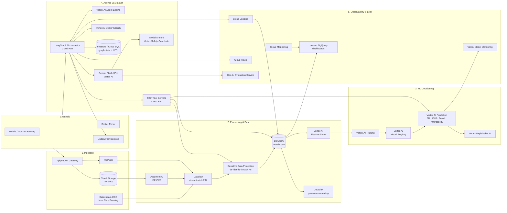

# 🏦 Use Case 1 — Mortgage Journey Accelerator
## Detailed Solution & GCP Reference Architecture (Lloyds Bank · Consumer Lending → Home Loans)

> **Companion to:** [`lloyds-home-loans-agentic-ai-usecases.md`](lloyds-home-loans-agentic-ai-usecases.md)
> **Scope of this document:** end‑to‑end design on **Google Cloud Platform (GCP) only** — from data ingestion → feature/ML → agentic LLM orchestration → production serving → post‑production **observability, logging, evaluation** — plus **guardrails, PII masking, human‑in‑the‑loop**, the **business justification**, the **role of LLMs (used cost‑effectively)**, and the **reason for Machine Learning**.

---

## 1. Executive Summary

The **Mortgage Journey Accelerator** is an **agentic underwriting co‑pilot** that turns a customer's raw document upload into a *fully packaged, risk‑assessed, decision‑ready* mortgage application. It uses **LangGraph** multi‑agent orchestration, **MCP tools** to reach systems of record, **deterministic ML models** for every scored decision (credit risk, valuation, fraud, affordability), and **Gemini LLMs** for the things LLMs are genuinely good at (reading messy documents, reasoning over gaps, drafting human‑quality explanations and customer messages).

It is deployed entirely on GCP, with **Document AI** for intelligent document processing, **Vertex AI** for ML + Gemini + agents, **BigQuery** as the analytical backbone, **Sensitive Data Protection (Cloud DLP)** for PII masking, **Model Armor / Vertex safety** for LLM guardrails, and **Cloud Logging/Monitoring/Trace + Vertex Model Monitoring + Gen AI Evaluation** for full observability.

---

## 2. The Business Problem (recap)

Mortgage origination today is slow (2–4 weeks to offer), manual (document chasing, re‑keying), opaque (no status visibility → high call volume), and inconsistent (manual underwriting variability). This drives **drop‑off, high cost‑to‑serve, broker churn, and a poor first experience** at the most important moment of the customer relationship.

---

## 3. How This Use Case Helps — Consumers & the Bank

### 3.1 How it helps **consumers**
- **Speed at the moment it matters most.** Straight‑through cases reach a decision in hours instead of weeks — decisive in a competitive house‑purchase chain.
- **"Upload once."** Document AI reads everything; the agent asks only for what is genuinely missing, in plain English.
- **Transparency.** Real‑time, explainable status ("verifying income", "valuing property") replaces the black box and the anxious wait.
- **Fairness & dignity.** Consistent, reason‑coded decisions; complex incomes (self‑employed, contractors) handled without endless back‑and‑forth.

### 3.2 How it helps the **bank**
- **Higher conversion & win‑rate** (faster offers win more completions).
- **Lower cost‑to‑serve** (automation of document handling, packaging, status comms).
- **Underwriter leverage** — humans see pre‑packaged, pre‑scored cases and focus on judgement, not data entry.
- **Consistency & auditability** — every decision has reason codes and a full trace, supporting **FCA Consumer Duty** evidence of good outcomes.
- **Scalability** — absorbs rate‑driven application spikes without linear headcount growth.

---

## 4. Why LLMs? (and why used sparingly / cost‑effectively)

### 4.1 The genuine need for LLMs
LLMs (Gemini on Vertex AI) are used **only where deterministic code and classical ML are weak**:
1. **Unstructured comprehension** — interpreting heterogeneous documents, free‑text, and messy edge cases after Document AI extraction.
2. **Reasoning over gaps** — deciding *what is missing* and *what to ask next* across a noisy, partial application.
3. **Tool orchestration** — choosing and sequencing MCP tool calls within the LangGraph agents.
4. **Human‑quality language** — drafting plain‑English gap requests, status updates, and **adverse‑action explanations** grounded in ML reason codes.

### 4.2 What LLMs are deliberately **NOT** used for
- **They never produce a credit score, valuation, affordability number, or fraud decision.** Those come from governed **ML models** + a deterministic policy layer. The LLM only *explains* them. This is essential for regulatory defensibility and to avoid hallucinated decisions.

### 4.3 Cost‑effective LLM strategy on GCP
| Technique | GCP mechanism | Effect |
|---|---|---|
| **Model cascade / right‑sizing** | **Gemini Flash / Flash‑Lite** for cheap high‑volume steps (classification, extraction clean‑up, routing); **Gemini Pro** only for complex reasoning & final explanation | Most calls hit the cheap tier |
| **Context caching** | **Vertex AI context caching** for stable, reused context (policy text, product rules, prompts) | Avoids re‑sending/recomputing large prompts |
| **Batch where possible** | Vertex AI **batch prediction** for non‑interactive steps | Lower unit cost than online |
| **Keep scoring in ML, not LLM** | Vertex AI Prediction endpoints | ML inference is far cheaper than an LLM token call |
| **RAG over fine‑tuning** | **Vertex AI Vector Search** + grounding | Avoids costly retraining; grounds answers, cuts hallucination |
| **Prompt/token discipline** | Structured outputs, short system prompts, function calling | Fewer tokens per call |
| **Caching deterministic results** | Memorystore (Redis) / Firestore | Don't re‑call the model for identical inputs |
| **Token & cost telemetry** | Cloud Monitoring custom metrics + BigQuery billing export | Per‑step cost visibility & budget alerts |

> **Principle:** the LLM is the *cheap‑where‑possible orchestrator and communicator*; ML is the *decision engine*; rules are the *guardrail*.

---

## 5. Why Machine Learning? (and how each model helps)

ML — not the LLM — makes the **scored decisions**, because lending decisions must be **accurate, calibrated, explainable, monitorable, and reproducible**.

| Model | Problem | Algorithm (Vertex AI) | How it helps |
|---|---|---|---|
| **Document classification** | Multiclass | Document AI custom processors / Vertex AutoML | Auto‑sorts payslips, statements, ID, deposit proof |
| **Information extraction (IDP)** | Extraction | **Document AI** (Custom Extractor / Bank Statement, ID parsers) | Removes manual re‑keying |
| **Transaction categorisation** | Multiclass | XGBoost/LightGBM on Vertex | Turns raw transactions into spend buckets |
| **Income estimation/verification** | Regression | Gradient boosting | Verifies declared vs observed income |
| **Credit risk / PD** | Binary classification | **Logistic regression (champion) + GBM (challenger)** | Calibrated, explainable default probability |
| **Property AVM** | Regression | Gradient boosting / quantile regression | Property value + confidence → LTV risk |
| **Fraud / synthetic ID** | Anomaly + classification | Isolation Forest + GBM | Detects novel and known fraud |
| **Reason codes** | Explainability | **Vertex Explainable AI / SHAP** | Adverse‑action + Consumer Duty transparency |

**Why ML over "just an LLM":** calibration & ranking quality, fairness testing across protected groups, drift monitoring, champion/challenger governance (SR 11‑7 / PRA model risk), reproducibility, and dramatically lower inference cost at scale.

---

## 6. GCP Reference Architecture (end‑to‑end)

### 6.1 High‑level architecture

### 6.2 Stage‑by‑stage GCP components

#### Stage 1 — Data Ingestion
- **Apigee** — secure API gateway for channel & broker traffic (rate limiting, auth, mTLS).
- **Cloud Storage (GCS)** — landing zone for uploaded documents (payslips, bank statements, ID, deposit proof); object‑level lifecycle + **CMEK** encryption.
- **Pub/Sub** — event backbone (`application.submitted`, `document.uploaded`) decoupling channels from processing.
- **Datastream** — change‑data‑capture from core banking / customer systems into BigQuery (near‑real‑time).
- *(Batch/bulk)* **Storage Transfer Service** / **BigQuery Data Transfer** for periodic feeds (bureau snapshots, product/rate tables).

#### Stage 2 — Processing, PII Handling & Data Platform
- **Document AI** — OCR + **Intelligent Document Processing**: bank‑statement parser, ID parser, custom extractors for payslips/deposit proof → structured fields.
- **Dataflow (Apache Beam)** — unified stream + batch ETL: validation, transaction categorisation features, joins, enrichment.
- **Sensitive Data Protection (Cloud DLP)** — **de‑identification / masking / tokenisation** of PII (name, DOB, account numbers, NI number) *before* data lands in analytics or is sent to any LLM (see §7.2).
- **BigQuery** — central warehouse: curated application, transaction, bureau, and property data; feature engineering in SQL; training datasets.
- **Vertex AI Feature Store** — online/offline feature serving with consistency between training and inference.
- **Dataplex** — data governance, cataloguing, lineage, and quality across the lake/warehouse.

#### Stage 3 — ML Decisioning
- **Vertex AI Pipelines (Kubeflow)** — reproducible train→evaluate→register→deploy MLOps.
- **Vertex AI Training** — custom XGBoost/LightGBM/logistic + scikit‑learn jobs.
- **Vertex AI Model Registry** — versioned models with champion/challenger lineage and approvals.
- **Vertex AI Prediction (online + batch endpoints)** — serves **PD, AVM, fraud, affordability** models with autoscaling; exposed to agents via MCP tools.
- **Vertex Explainable AI** — feature attributions → **reason codes** for adverse action & Consumer Duty.

#### Stage 4 — Agentic LLM Orchestration
- **LangGraph Orchestrator on Cloud Run** — the supervisor + specialist agents (Intake, Affordability, Credit & Risk, Valuation, Fraud/AML, Packaging, Comms); checkpointed state for durability/resume.
- **Vertex AI Agent Engine** — managed runtime/deployment + sessions/memory for the agentic app (optional managed hosting of the LangGraph app).
- **Gemini (Flash / Pro) on Vertex AI** — LLM reasoning & language generation, right‑sized per step (§4.3).
- **MCP Tool Servers on Cloud Run** — typed tools fronting Credit Bureau, Open Banking, Property/AVM, Core Banking, Document AI, KYC‑AML, and the Vertex ML endpoints.
- **Vertex AI Vector Search** — grounding/RAG over mortgage policy, product rules, and procedures (reduces hallucination, avoids fine‑tuning cost).
- **Firestore / Cloud SQL** — persistence of LangGraph state + human‑in‑the‑loop task queue.
- **Model Armor / Vertex AI safety filters** — prompt‑injection, jailbreak, toxicity, and data‑exfiltration guardrails on every LLM call (§7.1).

#### Stage 5 — Production Serving Surfaces
- Customer/broker status & request UI (Cloud Run / Firebase Hosting), Underwriter desktop with HITL approvals, and the offer‑generation service.
- **Cloud Load Balancing + Cloud Armor** for WAF/DDoS protection at the edge.

---

## 7. Guardrails, PII Masking & Human‑in‑the‑Loop (where & how)

### 7.1 Guardrails (LLM safety) — **at every LLM boundary**
- **Model Armor / Vertex AI safety filters** screen prompts and responses for prompt injection, jailbreaks, toxicity, and sensitive‑data leakage.
- **Grounding via Vertex AI Vector Search** — agents must cite retrieved policy; ungrounded claims are blocked.
- **Structured outputs / function calling** — constrain the LLM to schemas so it cannot "decide" a number it shouldn't.
- **Policy/rules layer** — a deterministic engine converts ML scores to accept/refer/decline; the LLM cannot override risk appetite.
- **Output validation** — schema + business‑rule checks before any customer‑facing message is sent.

### 7.2 PII masking — **at the data boundary, before analytics and before any LLM call**
- **Sensitive Data Protection (Cloud DLP)** performs inspection + **de‑identification** (masking, tokenisation, format‑preserving encryption, redaction) in the Dataflow path *before* data reaches BigQuery, and again in a **DLP pre‑processing hop in front of Gemini** so no raw PII is sent to the model unless strictly necessary.
- **CMEK** encryption, **VPC Service Controls** perimeter, and **Secret Manager** for credentials.
- **IAM least privilege** + **column‑level security** in BigQuery; access logged via Cloud Audit Logs.

### 7.3 Human‑in‑the‑Loop — **at material & edge‑case decisions**
- **LangGraph `interrupt` gate** pauses the graph and routes the pre‑packaged case to an **Underwriter Desktop**; the human approves / refers / declines.
- HITL is **mandatory** for: declines, complex income (self‑employed/contractor), high LTV, fraud red flags, low AVM confidence, and any vulnerable‑customer signal.
- State persists in Firestore so the graph resumes exactly where it paused after human input.
- Every human decision + rationale is logged for audit and to create labelled data for model improvement.

---

## 8. Post‑Production: Observability, Logging & Evaluation

### 8.1 Logging
- **Cloud Logging** — structured logs from Cloud Run agents, MCP tools, and ML endpoints; correlation IDs tie a single application across all hops.
- **Cloud Audit Logs** — who/what accessed which data and which decision was made (regulatory traceability).
- **BigQuery log sink** — logs streamed to BigQuery for analytics, with PII already masked.

### 8.2 Monitoring & Tracing
- **Cloud Monitoring** — SLOs (time‑to‑offer, STP rate, p95 latency), token‑cost custom metrics, budget/error alerts.
- **Cloud Trace** — distributed traces across LangGraph nodes → MCP tools → Vertex endpoints to find bottlenecks.
- **Error Reporting** — automatic grouping of exceptions.

### 8.3 ML model observability
- **Vertex AI Model Monitoring** — training/serving **skew**, feature **drift**, and prediction drift on PD/AVM/fraud models with alerting and retrain triggers.
- **Vertex Explainable AI** — ongoing attribution monitoring + fairness checks across protected groups.

### 8.4 LLM / agent evaluation
- **Vertex AI Gen AI Evaluation Service** — automated quality metrics (groundedness, helpfulness, safety, instruction‑following) on agent outputs and explanations, run on a golden dataset in CI and on sampled production traffic.
- **Online guardrail metrics** — injection‑block rate, hallucination/groundedness rate, escalation‑to‑human rate.
- **Human review loop** — sampled outputs reviewed; results feed prompt/RAG/model improvements.
- **Dashboards in Looker / BigQuery** — single pane for business KPIs, model health, LLM quality, and cost.

---

## 9. Business Justification

| Lever | Mechanism | Outcome |
|---|---|---|
| **Revenue** | Faster time‑to‑offer wins more completions in competitive chains | ↑ conversion / market share |
| **Cost** | Automate document handling, packaging, status comms | ↓ cost‑to‑serve per application |
| **Productivity** | Underwriters get pre‑scored, pre‑packaged cases | ↑ cases per FTE |
| **Quality** | Consistent, calibrated, reason‑coded decisions | ↓ rework, ↓ complaints |
| **Risk** | Champion/challenger ML + monitoring + HITL | better, auditable risk control |
| **Regulatory** | Explainability + audit trail + human oversight | demonstrable **Consumer Duty** good outcomes |
| **Cost discipline (AI)** | Gemini Flash cascade, context caching, ML‑for‑scoring | high automation at **controlled** LLM spend |

**KPIs to track:** time‑to‑offer (weeks→hours), document re‑request rate, straight‑through‑processing rate, application‑to‑completion conversion, cost‑to‑serve, underwriter throughput, "status" contact volume, LLM cost per application, model drift/quality, and Consumer Duty outcome metrics.

---

## 10. Why GCP‑native (consolidated)

| Capability | GCP service |
|---|---|
| API edge / security | Apigee, Cloud Load Balancing, Cloud Armor |
| Ingestion | Pub/Sub, Cloud Storage, Datastream, Storage Transfer |
| Document IDP | **Document AI** |
| ETL | Dataflow (Beam), Dataproc |
| Warehouse / analytics | **BigQuery** |
| Features | Vertex AI Feature Store |
| Governance/catalog | Dataplex, Data Catalog |
| ML train/serve/MLOps | **Vertex AI** (Pipelines, Training, Registry, Prediction, Explainable AI, Model Monitoring) |
| LLM | **Gemini on Vertex AI**, context caching, batch prediction |
| Agents | Vertex AI Agent Engine + **LangGraph on Cloud Run** |
| RAG | Vertex AI Vector Search |
| Guardrails | **Model Armor** / Vertex safety filters |
| PII masking | **Sensitive Data Protection (Cloud DLP)** |
| State / HITL | Firestore, Cloud SQL, Cloud Tasks/Workflows |
| Observability | Cloud Logging, Monitoring, Trace, Error Reporting |
| LLM evaluation | **Gen AI Evaluation Service** |
| Dashboards | Looker |
| Security/keys | IAM, VPC Service Controls, CMEK (Cloud KMS), Secret Manager |

---

## 11. Talking Points for Stakeholders
1. **Customer:** removes the two worst parts of getting a mortgage — the wait and the paperwork chase.
2. **Commercial:** speed wins completions; automation cuts cost‑to‑serve; underwriters scale.
3. **Risk & Regulatory:** ML decides, rules govern, humans approve, everything is explained and logged — built for Consumer Duty.
4. **AI economics:** Gemini used surgically (Flash cascade + caching) while ML does the cheap, accurate scoring — automation **without** runaway LLM cost.
5. **Platform:** 100% GCP‑native, so it inherits one security, governance, and observability fabric and is reusable across the wider Consumer Lending book.
