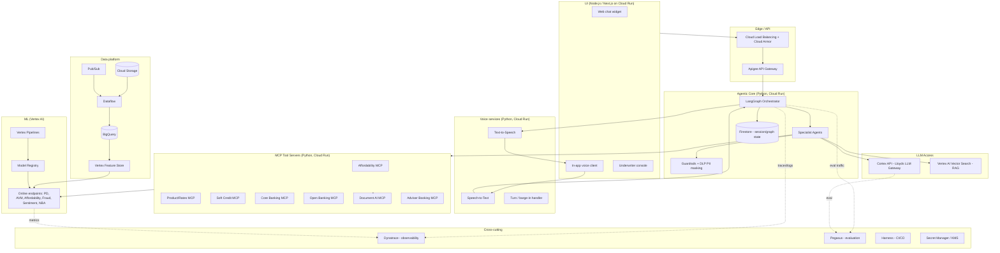
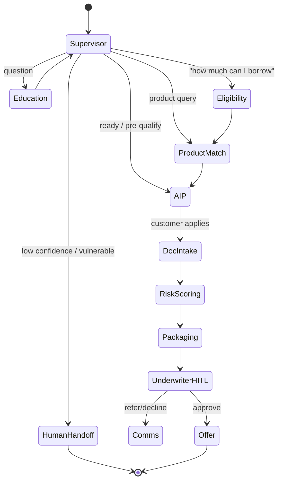
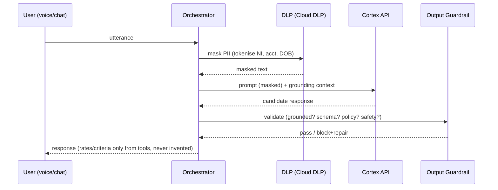
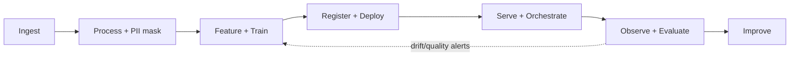
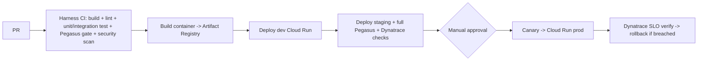

# 🛠️ Execution Plan & Low‑Level Design (LLD)
## Conversational Voice Mortgage Assistant + Mortgage Journey Accelerator — Lloyds Bank (Home Loans)

> **Type:** Engineering execution plan + Low‑Level Design (build‑ready)
> **Companion docs:** [`uc1-conversational-voice-mortgage-assistant.md`](uc1-conversational-voice-mortgage-assistant.md) · [`uc1-mortgage-journey-accelerator-gcp-architecture.md`](uc1-mortgage-journey-accelerator-gcp-architecture.md) · [`lloyds-home-loans-agentic-ai-usecases.md`](lloyds-home-loans-agentic-ai-usecases.md)
> **MVP constraints (mandated):**
> - **Cloud:** GCP resources **only**.
> - **Backend language:** **Python** (agents, services, ML, pipelines).
> - **UI:** **Node.js** (React/Next.js front‑end) — allowed exception.
> - **LLM access:** must go through **Cortex API** (Lloyds' governed LLM gateway) — no direct model calls.
> - **Evaluation:** must use **Pegasus** (Lloyds' evaluation framework).
> - **Observability:** **Dynatrace**.
> - **CI/CD:** **Harness** deploying into GCP.
> - **Coverage:** Conversational/voice assistant **and** the Mortgage Journey Accelerator (application + underwriting).

---

## 1. Problem We Are Solving

Mortgage customers (first‑time buyers, home movers, remortgagers, buy‑to‑let) find the journey confusing, jargon‑heavy and slow. They self‑serve across static pages/calculators or wait on hold; once they apply, getting to an offer takes weeks of manual document chasing and disconnected risk checks.

**This build delivers two connected capabilities:**
1. **Lloyds Home Coach** — an always‑on, voice + chat agentic assistant that educates, personalises, qualifies, and warms up any mortgage customer.
2. **Mortgage Journey Accelerator** — once the customer is ready, an agentic pipeline that ingests documents, runs ML risk scoring, and produces a decision‑ready, explainable case for an underwriter.

**MVP goal:** ship a thin but end‑to‑end vertical slice — *voice/chat → grounded Q&A → affordability + soft eligibility → Agreement‑in‑Principle → document intake → ML scoring → underwriter HITL* — fully on GCP, instrumented, evaluated (Pegasus), and CI/CD‑automated (Harness), with all LLM calls via Cortex API.

### 1.1 MVP scope (in / out)
| In scope (MVP) | Out of scope (later) |
|---|---|
| Web chat + in‑app voice (STT/TTS via GCP); 1 telephony POC line | Full omni‑channel telephony rollout |
| First‑time buyer + remortgage journeys | Full BTL/complex income automation |
| Affordability, soft eligibility, AIP (soft search), product match | Hard underwriting auto‑decision |
| Document intake (payslip, bank statement, ID) + PD/AVM/fraud scoring | Full product catalogue, all doc types |
| Guardrails, PII masking, HITL underwriter console | Advanced personalization, multilingual |
| Pegasus eval, Dynatrace, Harness CI/CD | Self‑learning/online RL |

---

## 2. Solution Architecture (GCP‑only)

### 2.1 Logical architecture



### 2.2 GCP service mapping (data ingestion → productionalization)

| Layer | GCP service(s) | Notes |
|---|---|---|
| Edge/security | Apigee, Cloud Load Balancing, Cloud Armor | WAF, DDoS, rate limit, mTLS |
| UI hosting | Cloud Run (Node.js) | Next.js SSR / static |
| Voice | Cloud Speech‑to‑Text, Cloud Text‑to‑Speech | Streaming STT, barge‑in; telephony POC via CCAI/SIP |
| Agentic core | Cloud Run (Python) | LangGraph orchestrator + agents |
| LLM | **Cortex API** (gateway) | All Gemini/LLM calls routed here; no direct Vertex LLM calls |
| RAG | Vertex AI Vector Search | Lloyds mortgage policy/product embeddings |
| State/memory | Firestore (+ Memorystore Redis cache) | Graph checkpoints, session, dedup cache |
| MCP tools | Cloud Run (Python) | One service per system of record |
| Document IDP | Document AI | Bank statement/ID/custom payslip parsers |
| ML train/serve | Vertex AI (Pipelines, Training, Registry, Prediction, Explainable AI, Model Monitoring) | PD, AVM, Fraud, Affordability, Sentiment, NBA |
| Ingestion | Cloud Storage, Pub/Sub, Datastream, Dataflow | Docs, events, CDC, ETL |
| Warehouse/features | BigQuery, Vertex Feature Store | Training data + online features |
| Governance | Dataplex, Data Catalog | Lineage, quality, catalog |
| PII | **Sensitive Data Protection (Cloud DLP)** | De‑identify before BQ + before Cortex |
| Secrets/keys | Secret Manager, Cloud KMS (CMEK) | Credentials, encryption |
| Perimeter | VPC Service Controls, Private Service Connect | Data exfiltration protection |
| Observability | **Dynatrace** (+ GCP integration) | APM, logs, traces, dashboards, SLOs |
| Evaluation | **Pegasus** | LLM/agent quality gates, golden sets |
| CI/CD | **Harness** | Build/test/deploy pipelines to GCP |

> **Why Cortex API:** Lloyds mandates all LLM traffic through Cortex for centralised model governance, prompt logging, cost control, safety, and tenancy. Our code depends on a thin `cortex_client` abstraction, never on a raw model SDK.

---

## 3. Low‑Level Design

### 3.1 Agentic graph (LangGraph) — nodes, state, edges

**Shared state object** (`AssistantState`, a typed `TypedDict`):
```python
class AssistantState(TypedDict):
    session_id: str
    customer_type: Literal["ftb", "mover", "remortgage", "btl", "unknown"]
    authenticated: bool
    messages: list[Message]          # conversation history
    intent: str | None
    entities: dict                   # income, deposit, property_value, etc.
    affordability: dict | None       # max_borrow, monthly_cost, ltv
    eligibility: dict | None         # pd_score, decision_band
    product: dict | None             # matched product
    aip: dict | None                 # agreement-in-principle result
    documents: list[DocRef]          # uploaded docs (Use Case 1)
    risk: dict | None                # pd, avm, fraud results
    escalate: bool                   # human handoff flag
    pii_masked: bool
    trace_id: str
```

**Nodes (agents)** and **edges**:


| Node | Module | LLM via Cortex? | ML endpoint(s) | MCP tools |
|---|---|---|---|---|
| Supervisor/Router | `agents/supervisor.py` | Yes (intent + routing) | Sentiment/Vulnerability | — |
| Education & Q&A | `agents/education.py` | Yes (grounded RAG) | — | Knowledge, Product |
| Eligibility & Affordability | `agents/eligibility.py` | Yes (explain) | Affordability, PD | Calc, Soft Credit, Open Banking |
| Product Match | `agents/product_match.py` | Yes (explain) | NBA/Reco | Product/Rates |
| Agreement‑in‑Principle | `agents/aip.py` | Yes | PD | Soft Credit, Core Banking |
| Document Intake | `agents/doc_intake.py` | Yes (gap reasoning) | — | Document AI |
| Risk Scoring | `agents/risk_scoring.py` | No (deterministic) | PD, AVM, Fraud | Credit Bureau, Property |
| Packaging & Explainability | `agents/packaging.py` | Yes (draft explanation) | Explainable AI | Core Banking |
| Underwriter HITL | `agents/hitl.py` | No | — | — |
| Comms/Handoff | `agents/comms.py` | Yes (draft message) | NBA | Comms, Booking |

### 3.2 MCP tool contract (example)

```python
# mcp_servers/affordability/server.py  (FastMCP, Python, Cloud Run)
from mcp.server.fastmcp import FastMCP
mcp = FastMCP("affordability")

@mcp.tool()
def calculate_affordability(income: float, outgoings: float,
                            deposit: float, property_value: float) -> dict:
    """Return max borrowing, monthly cost and LTV via the Vertex affordability model."""
    features = build_features(income, outgoings, deposit, property_value)
    result = vertex_predict(endpoint="affordability", instances=[features])
    return {"max_borrow": result.max_borrow,
            "monthly_cost": result.monthly_cost,
            "ltv": round(deposit_to_ltv(deposit, property_value), 2)}
```

### 3.3 Cortex API client (mandatory LLM boundary)

```python
# core/llm/cortex_client.py
class CortexClient:
    """Thin governed wrapper. ALL LLM calls go through Cortex (no direct model SDKs)."""
    def __init__(self, base_url: str, api_key: str): ...

    def generate(self, *, model_tier: str, system: str, messages: list,
                 tools: list | None = None, response_schema: dict | None = None,
                 cache_key: str | None = None) -> CortexResponse:
        # model_tier: "flash" (cheap, default) | "pro" (complex reasoning)
        # context caching via cache_key; structured output via response_schema
        ...
```
- **Cost control:** default `model_tier="flash"`, escalate to `"pro"` only for complex reasoning/explanations; pass `cache_key` for stable system/policy prompts; request `response_schema` for structured outputs (fewer tokens, safer).
- **Governance:** Cortex centrally logs prompts/responses, applies safety, and meters cost; our app stores only references + trace IDs.

### 3.4 Guardrails & PII masking (request lifecycle)

- PII masked **before** Cortex and **before** BigQuery.
- Output guardrail: groundedness check (must cite retrieved policy), JSON‑schema validation, business‑rule checks, safety filter. No LLM‑invented rates/criteria/decisions.

### 3.5 ML models (Vertex AI)
| Model | Type | Algo | Serving |
|---|---|---|---|
| Affordability/borrowing | Regression | GBM + rules | Online endpoint |
| Eligibility/Pre‑qual PD | Binary clf | Logistic (champion) + GBM (challenger) | Online |
| Property AVM | Regression | Quantile GBM | Online/batch |
| Fraud/anomaly | Anomaly+clf | IsolationForest + GBM | Online |
| Intent/Sentiment/Vulnerability | Multiclass | Transformer (via Cortex or small clf) | Online |
| Product NBA/Reco | Ranking/uplift | GBM/uplift | Online |
| Reason codes | XAI | SHAP / Vertex Explainable AI | Batch+online |

---

## 4. Repository / File Structure

Mono‑repo with Python services + Node.js UI, IaC, ML, MCP, and CI/CD.

```text
lloyds-home-coach/
├── README.md
├── Makefile
├── pyproject.toml                      # Python tooling (ruff, black, mypy, pytest)
├── .harness/                           # Harness CI/CD pipelines
│   ├── pipelines/
│   │   ├── ci.yaml                     # build, lint, unit test, Pegasus eval gate
│   │   ├── cd-dev.yaml
│   │   ├── cd-staging.yaml
│   │   └── cd-prod.yaml                # canary + approval
│   ├── services/                       # Harness service defs per Cloud Run svc
│   └── environments/                   # dev / staging / prod (GCP projects)
│
├── infra/                              # Terraform (GCP only)
│   ├── modules/
│   │   ├── cloud_run/  apigee/  pubsub/  gcs/  bigquery/
│   │   ├── dataflow/   vertex_ai/  firestore/  vector_search/
│   │   ├── dlp/        kms/  secret_manager/  vpc_sc/
│   │   └── dynatrace/                  # Dynatrace activegate / integration
│   ├── envs/{dev,staging,prod}/
│   └── README.md
│
├── services/                          # Python (Cloud Run)
│   ├── orchestrator/                  # LangGraph agentic core
│   │   ├── app/
│   │   │   ├── main.py                # FastAPI entrypoint
│   │   │   ├── graph.py               # LangGraph build (nodes/edges/state)
│   │   │   ├── state.py               # AssistantState TypedDict
│   │   │   ├── agents/
│   │   │   │   ├── supervisor.py  education.py  eligibility.py
│   │   │   │   ├── product_match.py  aip.py  doc_intake.py
│   │   │   │   ├── risk_scoring.py  packaging.py  hitl.py  comms.py
│   │   │   ├── core/
│   │   │   │   ├── llm/cortex_client.py        # MANDATORY LLM boundary
│   │   │   │   ├── guardrails/{input.py,output.py,dlp.py}
│   │   │   │   ├── rag/vector_search.py
│   │   │   │   ├── mcp/client.py               # MCP tool binding
│   │   │   │   ├── memory/firestore_store.py
│   │   │   │   └── telemetry/dynatrace.py      # OpenTelemetry -> Dynatrace
│   │   │   └── config.py
│   │   ├── tests/                     # unit + integration
│   │   ├── Dockerfile
│   │   └── requirements.txt
│   │
│   ├── voice/                         # Python: STT/TTS/turn-taking
│   │   ├── app/{main.py, stt.py, tts.py, turn.py, telephony.py}
│   │   ├── Dockerfile
│   │   └── requirements.txt
│   │
│   └── eval/                          # Pegasus integration service/jobs
│       ├── app/{run_eval.py, datasets/, metrics.py, pegasus_client.py}
│       ├── golden_sets/{ftb.jsonl, remortgage.jsonl, affordability.jsonl}
│       └── requirements.txt
│
├── mcp_servers/                       # Python MCP tool servers (Cloud Run)
│   ├── affordability/server.py
│   ├── product_rates/server.py
│   ├── soft_credit/server.py
│   ├── core_banking/server.py
│   ├── open_banking/server.py
│   ├── document_ai/server.py
│   ├── adviser_booking/server.py
│   └── common/{auth.py, dlp.py, schemas.py}
│
├── ml/                                # Vertex AI ML lifecycle (Python)
│   ├── pipelines/                     # Kubeflow/Vertex Pipelines
│   │   ├── train_pd.py  train_avm.py  train_affordability.py
│   │   ├── train_fraud.py  train_nba.py
│   │   └── components/{ingest.py, features.py, evaluate.py, register.py, deploy.py}
│   ├── features/                      # BigQuery SQL + Feature Store defs
│   ├── models/                        # training code (xgboost/sklearn)
│   ├── monitoring/                    # drift/skew + Explainable AI config
│   └── notebooks/
│
├── data/                              # Ingestion & ETL (Python/Beam)
│   ├── ingestion/{pubsub_consumers.py, gcs_loaders.py, datastream_cdc.py}
│   ├── dataflow/{etl_pipeline.py, transforms.py, dlp_redact.py}
│   └── bq_schemas/
│
├── ui/                                # Node.js (Next.js, Cloud Run)
│   ├── package.json
│   ├── app/                           # chat widget, voice client, underwriter console
│   │   ├── (chat)/  (voice)/  (underwriter)/
│   ├── components/  lib/  public/
│   └── Dockerfile
│
├── contracts/                         # OpenAPI + MCP tool schemas (shared)
│   ├── openapi/orchestrator.yaml
│   └── mcp/*.json
│
├── observability/
│   ├── dynatrace/{dashboards.json, slo.yaml, alerts.yaml}
│   └── otel/collector-config.yaml
│
└── docs/
    ├── architecture.md
    ├── runbook.md
    ├── threat-model.md
    └── eval-pegasus.md
```

---

## 5. Data Ingestion → Productionalization (pipeline phases)



1. **Ingest** — Docs → Cloud Storage; events → Pub/Sub; core‑banking CDC → Datastream.
2. **Process + PII mask** — Dataflow ETL; **Cloud DLP** de‑identify; curated tables in BigQuery; Dataplex governance.
3. **Feature + Train** — BigQuery + Feature Store; Vertex Pipelines train PD/AVM/Affordability/Fraud/NBA.
4. **Register + Deploy** — Model Registry (champion/challenger) → Vertex online endpoints.
5. **Serve + Orchestrate** — LangGraph orchestrator + MCP + Cortex serve live conversations/applications.
6. **Observe + Evaluate** — Dynatrace (APM/logs/SLO) + Vertex Model Monitoring (drift) + **Pegasus** (LLM/agent quality).
7. **Improve** — feedback + labelled HITL decisions retrain models; prompt/RAG updates gated by Pegasus.

---

## 6. Evaluation — Pegasus (Lloyds framework)

- **What:** Pegasus is the mandated evaluation framework for LLM/agent quality and safety gating.
- **Golden datasets** (`services/eval/golden_sets/`): curated FTB/remortgage/affordability conversations with expected groundedness, correctness, and safe behaviour.
- **Metrics:** groundedness (answer cites Lloyds policy), factual correctness vs tool outputs, instruction‑following, safety/guardrail‑block rate, hallucination rate, escalation appropriateness, tone/empathy.
- **Where it runs:**
  - **CI gate (Harness):** Pegasus runs on every PR against golden sets; pipeline **fails** if scores regress below thresholds.
  - **Pre‑prod:** larger Pegasus suite on staging before promotion.
  - **Production sampling:** sampled live conversations evaluated by Pegasus; results to Dynatrace dashboards + BigQuery.
- **Integration:** `services/eval/app/pegasus_client.py` submits transcripts + tool traces; thresholds in `docs/eval-pegasus.md`.

---

## 7. Observability — Dynatrace

- **Instrumentation:** OpenTelemetry from all Python services (orchestrator, voice, MCP, ML clients) and Node.js UI, exported to **Dynatrace**.
- **Traces:** one distributed trace per conversation/application across LangGraph nodes → Cortex → MCP → Vertex endpoints (using `trace_id` in state).
- **Metrics & SLOs (`observability/dynatrace/slo.yaml`):** latency p95 (voice turn, AIP), STT/TTS errors, Cortex token cost per conversation, MCP/tool error rates, ML endpoint latency, guardrail block rate, eval scores.
- **Logs:** structured logs (PII‑masked) to Dynatrace + BigQuery sink; Cloud Audit Logs for data/decision access.
- **Alerting:** Dynatrace Davis anomaly detection on latency/error/cost; pager on SLO burn.

---

## 8. CI/CD — Harness (deploying to GCP)



- **CI (`.harness/pipelines/ci.yaml`):** ruff/black/mypy, pytest (unit+integration), SAST/dependency scan, build images to **Artifact Registry**, **Pegasus eval gate**.
- **CD:** progressive `dev → staging → prod`; **canary** on Cloud Run with **Dynatrace SLO verification** and automatic rollback; **Terraform** (`infra/`) applied via Harness for GCP infra.
- **Secrets:** pulled from **Secret Manager** at deploy/runtime (Cortex keys, MCP creds) — never in code.
- **Environments:** separate GCP projects per env, isolated by VPC‑SC.

---

## 9. Security, Compliance & Guardrails (summary)
- **LLM only via Cortex API** (governance, logging, cost, safety).
- **PII masking via Cloud DLP** before Cortex and BigQuery; **CMEK**, **VPC‑SC**, **Secret Manager**.
- **AuthN/Z:** Apigee + OIDC; voice biometrics/step‑up before account data; least‑privilege IAM.
- **HITL:** mandatory for declines, complex income, high LTV, fraud flags, vulnerability; underwriter console.
- **Regulatory:** FCA Consumer Duty, MCOB (guidance vs regulated advice boundary), UK GDPR, WCAG accessibility.
- **Explainability:** SHAP/Vertex Explainable AI reason codes on every ML decision.

---

## 10. Execution Plan (phased, MVP)

| Phase | Outcome | Key deliverables |
|---|---|---|
| **0 — Foundations** | Landing zone ready | GCP projects, Terraform `infra/`, VPC‑SC, KMS, Secret Manager, Artifact Registry, Harness + Dynatrace + Cortex + Pegasus connectivity |
| **1 — Data & ML base** | Models serving | Ingestion (GCS/PubSub/Datastream), Dataflow+DLP, BigQuery, Feature Store, Vertex Pipelines for Affordability + PD; endpoints live |
| **2 — Agentic core** | Chat MVP | LangGraph orchestrator, Supervisor/Education/Eligibility agents, Cortex client, RAG (Vector Search), MCP affordability/product/soft‑credit, guardrails+DLP, Firestore state |
| **3 — Voice** | Voice MVP | STT/TTS streaming, turn/barge‑in, voice client UI, telephony POC, sentiment/vulnerability routing |
| **4 — Journey Accelerator** | Application path | AIP agent, Document AI MCP, Document Intake + Risk Scoring (PD/AVM/Fraud) agents, Packaging + Underwriter HITL console |
| **5 — Quality & Ops** | Production‑ready | Pegasus golden sets + CI gate, Dynatrace dashboards/SLOs, Model Monitoring, Harness canary + rollback, runbooks |
| **6 — Pilot** | Controlled launch | Limited FTB/remortgage cohort, monitor KPIs, feedback loop into retrain/prompt updates |

### 10.1 Definition of Done (MVP)
- End‑to‑end slice works: voice/chat → grounded Q&A → affordability/eligibility → AIP → doc intake → ML scoring → underwriter HITL.
- 100% LLM calls via **Cortex**; PII masked; guardrails enforced.
- **Pegasus** gates green in Harness CI; **Dynatrace** SLOs defined and observed; canary + rollback proven.
- All infra via Terraform on **GCP only**; Python backend, Node.js UI.

### 10.2 Key risks & mitigations
| Risk | Mitigation |
|---|---|
| Cortex latency/limits | Flash‑tier default, context caching, async + timeouts, graceful degrade to human |
| Voice latency | Streaming STT/TTS, barge‑in, regional endpoints, p95 SLO + Dynatrace alerts |
| Hallucinated rates/criteria | Mandatory RAG grounding + output guardrail + tools‑only facts |
| Model drift | Vertex Model Monitoring + retrain triggers; champion/challenger |
| Regulatory (advice boundary) | Guidance‑only scoping, HITL for advice, MCOB/Consumer Duty review |
| Eval regressions | Pegasus CI gate blocks promotion |

---

## 11. KPIs (MVP success)
Containment/self‑serve rate, interest→AIP→application conversion, time‑to‑AIP, time‑to‑offer (UC1), STP rate, contact deflection, CSAT/NPS, vulnerability detection/escalation rate, **Cortex cost per conversation**, Pegasus quality scores, Dynatrace SLO attainment.
